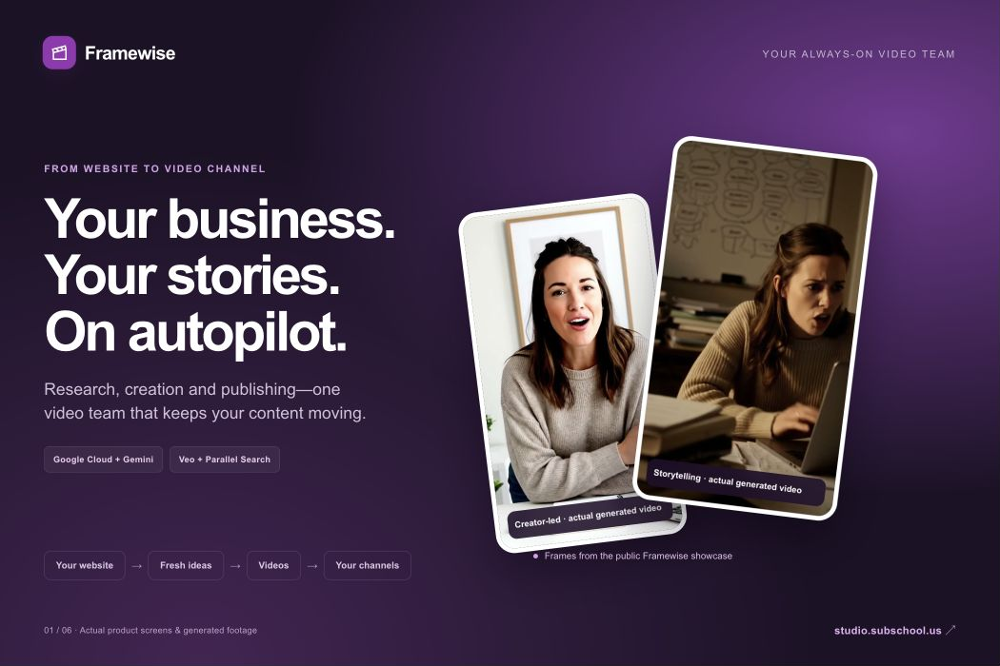
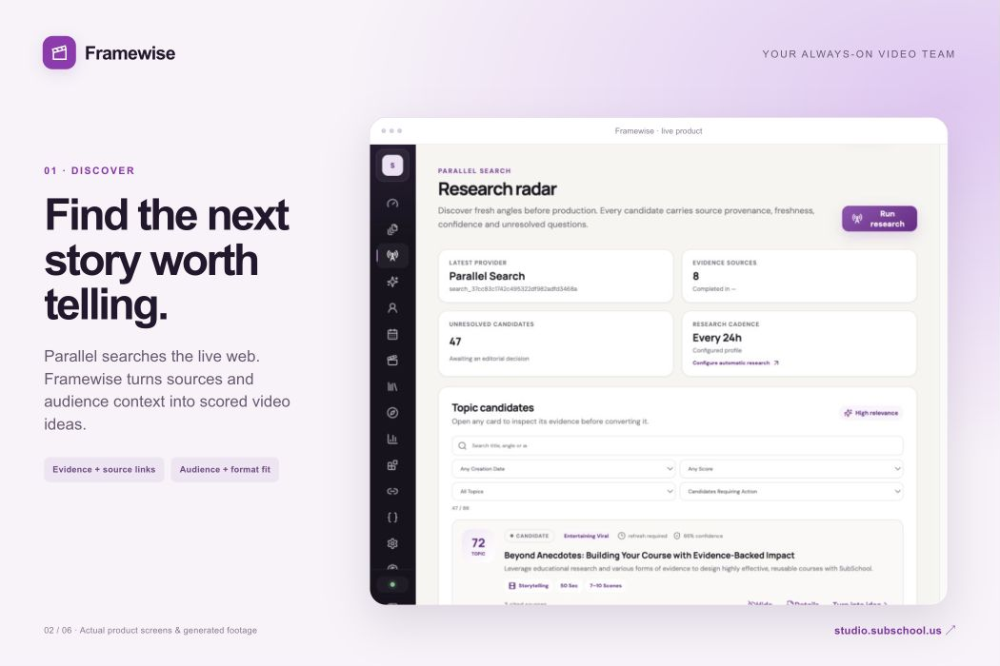
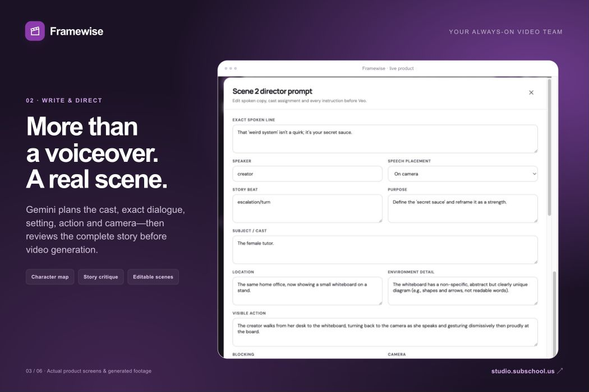
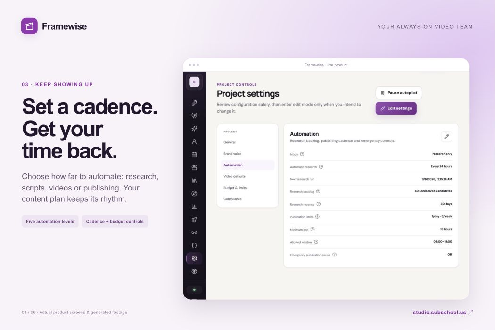
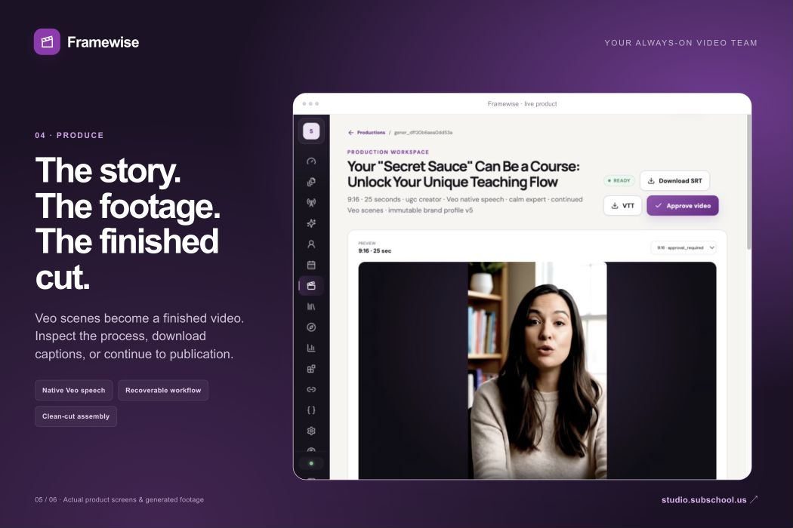
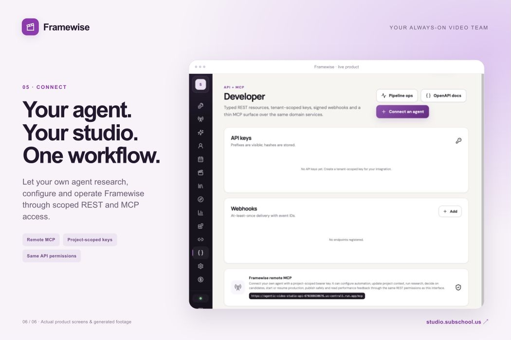

# Framewise
### Your always-on video team.

**Turn your website into a channel that keeps showing up.** Framewise researches relevant topics, writes and directs stories, generates short-form videos, and publishes to connected channels—so running your business does not also mean running a content department.

**[Start creating →](https://studio.subschool.us)** · [Watch real examples](https://studio.subschool.us/#examples) · [How it works](#from-website-to-published-video) · [Run locally](#run-locally)



## From website to published video

Give Framewise your website. Review what it learned about your product and audience. Choose your content mix, cadence, preferred video style, and connected channels. Fund your balance. The workflow takes it from there, up to the automation level you choose.

| Your direction | Your video team's work |
| --- | --- |
| **What you sell and who you help** | Analyze the website into a product brief, audience, problem, solution, and search keywords. |
| **What your channel should achieve** | Balance useful, entertaining, and product-led ideas; rank them before production. |
| **How often to show up** | Research on schedule and turn selected ideas into scripts, videos, or published posts. |
| **How the story should feel** | Choose creator-led UGC, storytelling/sketches, cinematic scenes, or motion graphics; set voice and format defaults. |
| **How much to spend** | Use a USD balance, cost estimates, and monthly budget controls. No subscription required. |

You can let the workflow run or step into any production to inspect sources, edit a scene, regenerate a script with feedback, and resume a failed step.

### Find the next story—not another blank page

Parallel Search supplies live web evidence and audience questions. Every research run preserves its queries and sources. Candidates carry the audience insight, purpose, message, creative direction, score, recommended format, and duration into production.



### Direct the scene before generating the pixels

Gemini writes more than voiceover: character identity, exact dialogue, setting, physical action, blocking, camera movement, and sound direction. A whole-script critique checks narrative and product logic before expensive video generation. Veo continuation follows the relevant speaker, not blindly the last clip.



### Set the cadence. Keep the control.

Five levels match how much you want to delegate: **Off → Research only → Create scripts → Create videos → Publish.** Publishing mode continues through connected channels when checks pass; routine manual post confirmation is not part of that mode. Review modes remain available.



### Real output, one production workspace

Actual generated examples are available on the [live site](https://studio.subschool.us/#examples):

- [Example 01 — creator-led video](https://youtube.com/shorts/hBCFkrmh6RY)
- [Example 02 — storytelling](https://youtube.com/shorts/3v477HqSojU)
- [Example 03 — creator-led video](https://youtube.com/shorts/GZ2AjzDTJw4)

These demonstrate generated output, not guaranteed audience growth. The public showcase files are also in [apps/web/public/showcase](apps/web/public/showcase). Native speech quality and character consistency can vary by scene; individual scene retries and an alternative Google Cloud TTS path are available.



### Bring your own agent

Use the interface—or let your agent operate the same studio. **Developer → Connect an agent** creates a revocable project-scoped key and an MCP client configuration. REST and MCP cover context, automation, research, candidate decisions, production, publishing, and feedback with the same authorization checks.



## Why this is more than a video generator

- **Research changes what gets produced.** Parallel is upstream of Gemini and Veo, not an optional link list after generation.
- **The story is reviewed before the video is bought.** Structured planning and a critique/revision loop precede scene generation.
- **Work survives interruptions.** Production packages and scene checkpoints are persisted; recovery targets unfinished work.
- **Feedback returns to discovery.** Selected/hidden ideas and available publication metrics inform future searches. Early signals are treated conservatively, not as proof of virality.
- **The last mile is included.** Rendering, captions, publication adapters, scheduling, balance controls, and monitoring live in the same product.

YouTube uses official APIs. Instagram and TikTok use encrypted browser sessions and Playwright adapters; they remain dependent on platform login challenges and interface changes. Accounts may need reconnection. Exports are always available.

## Built on Google Cloud + Parallel

Framewise's live engine is a durable, application-managed **Gemini/tool workflow**. It calls Parallel Search over HTTPS, calls Google models through `google-genai`, persists typed outputs, reviews and revises drafts, then executes media and publishing tools.

```text
Website + audience + goals
          ↓
Parallel Search → evidence + candidate scoring
          ↓
Gemini planning ↔ whole-script critique
          ↓
Cast + dialogue + scene direction
          ↓
Veo / Google TTS → FFmpeg → QA
          ↓
Connected channels → observed response
          └──────────────────→ next research
```

- **AI:** Gemini 2.5 Pro for editorial work, Gemini for research synthesis and review, Veo 3.1, Google Cloud Text-to-Speech.
- **Application:** Nuxt 4 / Vue / TypeScript; Python / FastAPI / Pydantic.
- **Cloud:** Cloud Run, Cloud SQL (PostgreSQL), Cloud Storage, Secret Manager, Artifact Registry, Cloud Build, Scheduler, Workflows, Pub/Sub.
- **Operations:** ClickHouse, Grafana, structured events, cost records, and bounded retries.
- **Access:** Google/email sign-in, rotating refresh sessions, project-scoped REST keys and MCP.

The Google ADK role definitions in `agents.py` are not a live ADK Runner network. The runtime integration evidence is the actual Gemini and Parallel calls linked in the [evidence map](docs/submission/runtime-evidence.md).

## Run locally

You can use the [hosted product](https://studio.subschool.us) without installing anything. For development or credential-free evaluation:

**Prerequisites:** Python 3.12+ (CI uses 3.13), Node.js 22+, pnpm 10, FFmpeg.

```bash
git clone https://github.com/SubSchoolLTD/agentic-video-studio.git
cd agentic-video-studio
cp .env.example .env
python3.13 -m venv .venv
.venv/bin/pip install -e '.[dev]'
pnpm install --frozen-lockfile
```

Keep `PROVIDER_MODE=mock` and `EMAIL_DELIVERY_MODE=log` for local evaluation. Replace the local signing-secret placeholders in `.env` before using real data. Run the two services in separate terminals:

```bash
# Terminal 1
.venv/bin/uvicorn apps.api.app.main:app --reload --port 8000
```

```bash
# Terminal 2
pnpm --filter @avs/web dev
```

Open [localhost:3000](http://localhost:3000), register, and use the verification link printed by the API's local email logger. The mock mode needs no Google or Parallel credentials and still renders a real placeholder MP4 with FFmpeg. **Mock footage is not AI-generated footage.** Automated end-to-end fixtures also exercise account and balance-dependent flows.

| Provider mode | Behavior |
| --- | --- |
| `mock` | Deterministic fixtures and local placeholder media; no paid provider calls. |
| `hybrid` | Real Parallel/Gemini research and editorial, local placeholder video. |
| `live` | Real configured providers. Generation can incur costs; publishing can create external posts. |

For live mode, set Google Cloud and Parallel credentials using [configuration](docs/operations/configuration.md). In Cloud Run use workload identity and Secret Manager, not a service-account key in the repository. Install the browser runtime for local social-adapter work with `.venv/bin/python -m playwright install chromium`.

## Verification and deployment

```bash
.venv/bin/ruff check apps/api apps/mcp tests migrations
.venv/bin/pytest
pnpm lint
pnpm typecheck
pnpm test:web
pnpm build
pnpm test:e2e
```

CI also validates Terraform, scans Git history for secrets, and builds the containers. Production deployment is an explicit GitHub Actions workflow using Workload Identity Federation.

- [Architecture](docs/architecture/architecture.md)
- [Configuration and secret handling](docs/operations/configuration.md)
- [Deployment](docs/operations/deployment.md)
- [Dated live-validation record](docs/operations/live-validation.md)
- [Runtime evidence and judge walkthrough](docs/submission/runtime-evidence.md)
- [Submission story and gallery](docs/submission/README.md)
- [Security policy](SECURITY.md)

## Repository map

```text
apps/api        Durable workflow, providers, API, billing, rendering and publishing
apps/mcp        Authenticated agent interface over the same domain API
apps/web        Product UI, onboarding and public website
docs            Product, architecture, operations and submission materials
infra           Deployment and observability configuration
tests           Unit, contract, security, integration and pipeline tests
```

## License

[Apache License 2.0](LICENSE). Third-party services require their own accounts and terms; the source license does not grant access to those services. Public showcase media is identified in [gallery provenance](docs/submission/gallery.md).
