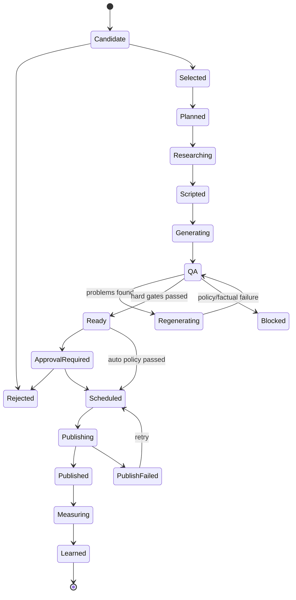
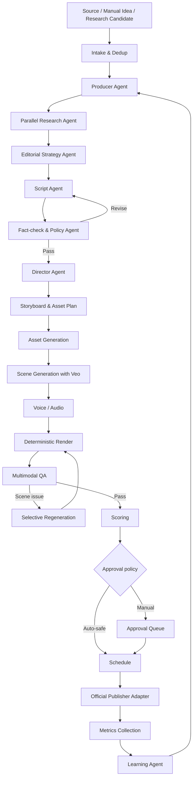
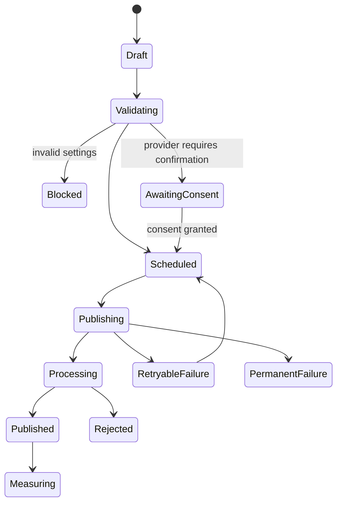
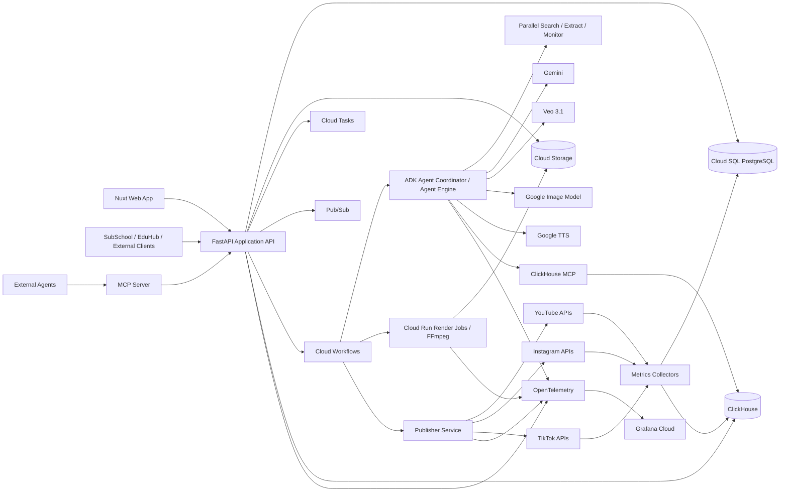

# Техническое задание: Agentic Video Studio

**Рабочее название:** Agentic Video Studio (название продукта требуется выбрать отдельно)  
**Версия документа:** 1.0  
**Дата:** 9 августа 2026 года  
**Статус:** проектирование / основание для реализации MVP и конкурсной версии  
**Основной партнёрский трек хакатона:** Parallel  
**Первые пилотные проекты:** SubSchool и EduHub  
**Целевой формат продукта:** мультитенантный веб-сервис + REST API + MCP-сервер

---

## 1. Резюме продукта

Agentic Video Studio — автономная студия короткого видеоконтента для независимых создателей, образовательных медиа, небольших редакций и продуктовых команд. Сервис превращает исходные материалы, идеи и сигналы из открытого веба в готовые вертикальные и горизонтальные ролики, публикует их в подключённые каналы, собирает результаты и использует накопленные данные для улучшения следующих генераций.

Продукт должен закрывать полный цикл:

```text
Источники и идеи
→ веб-исследование
→ выбор перспективного угла
→ сценарий и раскадровка
→ генерация сцен и озвучки
→ монтаж и QA
→ скоринг
→ согласование или автоматическая публикация
→ сбор результатов через 24 часа и 7 дней
→ обновление контентной стратегии
```

Ключевое отличие от обычного «генератора роликов» — система не выполняет один prompt-to-video запрос. Она поддерживает состояние проекта, знает бренд и аудиторию, регулярно исследует новые темы через Parallel, принимает решения с помощью сети агентов, хранит историю экспериментов и адаптирует последующие идеи на основе реальной эффективности опубликованного контента.

---

## 2. Продуктовые и технические решения, принятые заранее

### 2.1. Основной партнёр — Parallel

Parallel Search API должен активно вызываться во время работы продукта. Он используется не декоративно, а в критическом пользовательском пути:

- анализ внешнего контекста вокруг исходного материала;
- поиск свежих тем и вопросов аудитории;
- поиск аргументов, фактов и первичных источников;
- проверка актуальности и подтверждение утверждений;
- оценка насыщенности темы конкурирующим контентом;
- поиск новых событий для автоматических контентных циклов.

Parallel Monitor API применяется опционально для постоянного наблюдения за темами и получения webhook-событий. Он не заменяет Search API: любой автоматически обнаруженный сигнал должен проходить дополнительный Search-запрос для расширения контекста и проверки.

### 2.2. ClickHouse и Grafana — вспомогательные компоненты

ClickHouse не является основной транзакционной базой. Он хранит события, метрики, признаки роликов, стоимость генераций и результаты публикаций. PostgreSQL остаётся источником истины для пользователей, проектов, настроек, задач, согласований и подключений.

Grafana используется для системной наблюдаемости: метрики, логи, трассировки, стоимость, ошибки внешних API и состояние очередей. В расширенной версии Ops Agent может читать Grafana через MCP и объяснять причины сбоев, но этот сценарий не является центральной ценностью продукта.

### 2.3. Официальные API публикации вместо Playwright

Для YouTube, Instagram и TikTok существуют официальные способы загрузки контента. Поэтому автоматизация авторизации и публикации через браузер не входит в production-архитектуру.

Причины:

- браузерная автоматизация нестабильна и ломается после изменения интерфейса;
- хранение логинов, паролей и cookies увеличивает риск компрометации;
- обход официальных механизмов может нарушать правила платформ;
- открытый конкурсный репозиторий делает подобную реализацию особенно неприятной;
- TikTok прямо требует специальный UX, явное согласие пользователя и аудит API-клиента.

Playwright допускается только для анализа публичных сайтов, получения скриншотов страниц и проверки визуального отображения. Он не используется для входа в социальные сети и публикации от имени пользователя.

### 2.4. Ограничение TikTok

Полностью безлюдный автопостинг в TikTok не заявляется как гарантированная возможность.

Поддерживаются два режима:

1. **Draft / Upload mode** — сервис передаёт готовый ролик в TikTok, пользователь завершает публикацию внутри TikTok.
2. **Interactive Direct Post** — после прохождения аудита API-клиента пользователь на экране публикации видит превью, вручную выбирает privacy и interaction settings и явно подтверждает отправку.

Для неаудированного TikTok API-клиента публикации доступны только в private-режиме. Даже после аудита продукт должен сохранять обязательное управление и согласие пользователя. Поэтому настройка `autopublish=true` для TikTok фактически означает «автоматически подготовить и запросить подтверждение», а не тайно отправить ролик ночью, пока пользователь спит и не подозревает, что у него уже новый шедевр с шестью пальцами.

### 2.5. Агентность и детерминированная оркестрация разделяются

Агенты отвечают за задачи, где требуется решение:

- исследование;
- выбор угла;
- написание и оценка сценария;
- режиссура;
- диагностика качества;
- формирование стратегии.

Детерминированные сервисы отвечают за:

- очереди;
- переходы состояний;
- повторные попытки;
- хранение;
- рендеринг;
- субтитры;
- публикацию;
- сбор метрик;
- контроль бюджета.

Нельзя строить весь продукт как одного агента, которому дали 40 инструментов и пожелали удачи. Долгие генерации и публикации должны управляться устойчивой state machine.

### 2.6. Модельный стек

В конкурсной runtime-версии допускаются только Google Cloud AI и разрешённые функции выбранного партнёра. Поэтому:

- Gemini — reasoning, structured generation, multimodal QA;
- Google ADK / Agent Platform — агенты и MCP-интеграции;
- Veo 3.1 — видеосцены;
- Google Cloud Text-to-Speech / Gemini TTS — озвучка;
- Imagen или поддерживаемая Google-модель изображений — референсы, раскадровка, отдельные визуальные элементы;
- Vertex AI embeddings — семантический поиск и дедупликация;
- Parallel Search — веб-исследование;
- FFmpeg — детерминированный монтаж и экспорт.

Конкретные model ID не должны быть жёстко зашиты в бизнес-логику. Они задаются конфигурацией окружения и prompt/model registry.

---

## 3. Цели и нецели

### 3.1. Цели P0 — конкурсный MVP

1. Создать отдельный новый мультитенантный продукт.
2. Позволить создать проект по URL сайта и короткому брифу.
3. Поддержать ручную идею, URL статьи, текст, RSS и REST API как источники.
4. Регулярно находить темы через Parallel Search.
5. Генерировать готовый ролик как минимум в 9:16, а также поддержать 16:9.
6. Выполнять автоматический факт-чек, технический и брендовый QA.
7. Рассчитывать объяснимый скор перспективности и готовности к публикации.
8. Поддержать ручное согласование и ограниченный автопилот.
9. Публиковать через официальные API как минимум в YouTube; подготовить Instagram и TikTok adapters с корректными режимами доступа.
10. Собирать доступные метрики через 24 часа и 7 дней.
11. Использовать результаты для следующего цикла идей.
12. Предоставить REST API и минимальный MCP-сервер.
13. Писать события и метрики в ClickHouse.
14. Отправлять telemetry в Grafana.
15. Иметь работающий англоязычный интерфейс или полноценную английскую локализацию для хакатона.

### 3.2. Цели P1 — первая рабочая версия после MVP

- полноценная multi-project работа;
- несколько подключённых аккаунтов каждой платформы;
- улучшенный scene editor;
- Parallel Monitor;
- расширенные эксперименты и learning loop;
- планирование публикаций по каналам;
- несколько языков и локализаций одного ролика;
- лимиты, usage ledger и тарифы;
- командные роли и согласование;
- устойчивые retries и production-grade observability.

### 3.3. Нецели

В рамках MVP не создаются:

- полноценный нелинейный видеоредактор уровня Premiere;
- управление комментариями и личными сообщениями в соцсетях;
- рекламный кабинет и закупка платного трафика;
- гарантии вирусности, просмотров или продаж;
- обучение собственной foundation-модели;
- копирование чужих роликов или массовый рерайт чужого контента;
- публикация через логин/пароль и browser automation;
- генерация цифровых двойников реальных людей без явного разрешения;
- общий анонимный benchmark между клиентами без opt-in и юридической базы.

---

## 4. Приоритеты требований

- **P0** — обязательно для конкурсного MVP и демонстрации.
- **P1** — требуется для первой production-версии, можно частично реализовать в хакатонной сборке.
- **P2** — развитие после подтверждения ценности.

---

## 5. Пользователи и роли

### 5.1. Основные персоны

#### Владелец проекта / founder

Хочет подключить сайт, RSS или существующий контентный pipeline и получить регулярный выпуск роликов без создания отдельной редакции.

#### Контент-менеджер / редактор

Управляет идеями, контент-планом, сценариями, проверяет ролики и публикует их.

#### Creator / автор

Использует сервис как виртуальную продакшн-команду: задаёт идеи, выбирает стиль, получает готовые варианты.

#### Разработчик клиента

Подключает REST API, webhook и MCP, чтобы отправлять материалы из SubSchool, EduHub или другой системы.

#### Аналитик / growth-менеджер

Смотрит, какие темы, hooks и форматы работают, и управляет экспериментами.

### 5.2. Роли внутри организации

| Роль | Возможности |
|---|---|
| Owner | Все операции, billing, удаление организации, управление ключами и социальными подключениями |
| Admin | Проекты, пользователи, интеграции, публикации, настройки |
| Editor | Идеи, генерации, редактирование, approval, календарь |
| Publisher | Согласование и публикация, без изменения ключевых брендовых настроек |
| Analyst | Чтение метрик, отчётов и стратегии |
| Viewer | Только чтение |
| API service account | Только выданные scopes, без интерактивного входа |

Каждая операция должна проверять `organization_id`, `project_id`, роль и scope. Доступ к одному проекту не должен давать доступ к другим проектам той же организации без явного назначения.

---

## 6. Основные сущности и жизненный цикл

### 6.1. Ключевые сущности

- Organization
- User
- Membership
- Project
- Brand Profile
- Content Source
- Source Item
- Research Profile
- Research Run
- Topic Candidate
- Content Idea
- Content Plan / Calendar Item
- Generation Job
- Script Version
- Scene
- Media Asset
- Video Version
- QA Report
- Score Report
- Approval
- Social Connection
- Publication Job
- Metric Snapshot
- Performance Review
- Strategy Version
- Experiment
- API Key
- MCP Client
- Webhook Endpoint
- Audit Event

### 6.2. Жизненный цикл контентной единицы



### 6.3. Уровни автоматизации

| Режим | Поведение |
|---|---|
| Manual | Все идеи, генерации и публикации запускает человек |
| Assisted | Исследование и генерация автоматические, публикация только после approval |
| Auto-safe | Автопубликация разрешена при прохождении hard gates, порогов score и confidence |
| Draft-only | Сервис создаёт материалы, но никогда не публикует |

Режим задаётся для проекта и может быть переопределён для конкретного источника или платформы. TikTok ограничивается Draft/Assisted независимо от глобального значения.

---

## 7. Онбординг и создание проекта

### 7.1. Стартовый сценарий

Пользователь нажимает `Create project` и проходит мастер:

1. Название проекта и основной URL.
2. Анализ сайта.
3. Подтверждение автоматически составленного бренд-профиля.
4. Короткий бриф.
5. Настройки контента и генерации.
6. Подключение источников.
7. Подключение каналов публикации.
8. Выбор режима согласования.
9. Тестовая идея и первый ролик.

Пользователь может пропустить подключения и вернуться к ним позже. Проект становится `active`, когда заполнен минимальный набор: название, основная аудитория, язык, цель, допустимый CTA и хотя бы один источник или ручная идея.

### 7.2. Анализ сайта

#### FR-PROJ-001 — создание проекта из URL `[P0]`

Вход:

- URL;
- основной язык или `auto`;
- регион или `global`;
- подтверждение права использовать контент сайта.

Алгоритм:

1. Нормализовать URL и проверить DNS/HTTPS.
2. Запретить localhost, private network ranges и SSRF-направления.
3. Получить `robots.txt`, `sitemap.xml`, canonical URL и основные metadata.
4. Выбрать приоритетные страницы: homepage, about, product/features, pricing, blog/category, 3–10 свежих материалов.
5. Получить содержимое через Parallel Extract либо безопасный HTTP/browser renderer.
6. Выполнить Parallel Search по бренду и домену, чтобы увидеть внешний контекст, упоминания и связанные темы.
7. Извлечь:
   - описание продукта;
   - аудитории;
   - ценностные предложения;
   - основные функции;
   - доказательства и публичные факты;
   - CTA;
   - языки;
   - географию;
   - визуальные признаки;
   - социальные ссылки;
   - потенциально рискованные утверждения.
8. Сформировать черновик Brand Profile с confidence по каждому полю.
9. Показать пользователю diff-friendly форму для подтверждения.

Ограничения:

- максимум страниц на первичный анализ задаётся конфигурацией, рекомендуемый P0 — 20;
- не обходить авторизацию;
- не игнорировать robots.txt без явного основания;
- не сохранять лишние персональные данные;
- не использовать найденные внешние изображения без проверки лицензии.

#### FR-PROJ-002 — повторный анализ `[P1]`

Пользователь может запустить re-scan. Изменения не перезаписывают подтверждённый профиль автоматически. Система создаёт proposal с полями `old`, `suggested`, `source`, `confidence`.

### 7.3. Короткий бриф

Обязательные поля:

- что это за проект;
- основная аудитория;
- главная цель видео: awareness, traffic, lead, install, purchase, education;
- ключевое действие зрителя;
- основной язык;
- география;
- допустимый CTA;
- темы, которые нельзя затрагивать.

Рекомендуемые поля:

- вторичные аудитории;
- проблемы аудитории;
- продукты/курсы/функции для продвижения;
- tone of voice;
- примеры хорошего и плохого контента;
- конкуренты;
- обязательные факты;
- запрещённые обещания;
- юридические оговорки;
- допустимый юмор;
- возрастные ограничения;
- политика использования людей и лиц;
- предпочтительные форматы и длительность;
- целевые каналы.

### 7.4. Brand Profile

Профиль содержит:

```yaml
identity:
  name: string
  website: url
  description: string
  category: string
  languages: [string]
  regions: [string]
audiences:
  primary: []
  secondary: []
value_propositions: []
products_or_offers: []
tone:
  traits: []
  prohibited_traits: []
claims:
  allowed: []
  require_source: []
  prohibited: []
visual:
  palette: []
  logo_assets: []
  fonts: []
  references: []
  forbidden_styles: []
cta:
  primary: string
  alternatives: []
  target_urls: []
compliance:
  high_risk_topics: []
  mandatory_disclosures: []
  age_policy: string
source_policy:
  trusted_domains: []
  blocked_domains: []
  max_source_age_days: integer
```

У каждого автоматически полученного поля есть:

- `source_ids`;
- `confidence`;
- `confirmed_by_user`;
- `last_verified_at`.

### 7.5. Настройки проекта

Разделы настроек:

1. General.
2. Brand & audience.
3. Sources.
4. Research.
5. Generation.
6. Voice & subtitles.
7. Publishing schedule.
8. Scoring & approval.
9. Budget & quotas.
10. Integrations.
11. API & MCP.
12. Notifications.
13. Compliance.

---

## 8. Источники контента

### 8.1. Типы источников

#### Ручная идея `[P0]`

Пользователь вводит тему, тезис или вопрос. Можно указать:

- цель;
- аудиторию;
- формат;
- обязательные факты;
- ссылки;
- желаемую дату публикации;
- нужен ли дополнительный research.

#### URL страницы или статьи `[P0]`

Сервис извлекает заголовок, основной текст, автора, дату, canonical URL, изображения и metadata. Контент очищается от навигации и рекламы.

#### Вставленный текст / Markdown / HTML `[P0]`

Используется для материалов, которые ещё не опубликованы.

#### RSS / Atom `[P0]`

Настройки feed:

- URL;
- polling interval;
- category/tag filters;
- language filter;
- minimum content length;
- delay after publication;
- max videos per item;
- target formats;
- approval mode;
- duplicate policy;
- daily and weekly caps.

#### REST API `[P0]`

Клиент отправляет статью, URL, идею или campaign brief. API возвращает job ID и отправляет webhook после каждого важного состояния.

#### Webhook inbound `[P1]`

Проект получает событие от CMS или генератора статей.

#### Регулярное веб-исследование `[P0]`

Система сама создаёт кандидатов через Parallel Search по расписанию.

#### Parallel Monitor `[P1]`

Монитор отслеживает новые события по заранее заданному запросу и вызывает webhook продукта.

#### Файл `[P1]`

PDF, DOCX, TXT, MD и изображения. Для конкурсного MVP достаточно текста, MD и PDF через поддерживаемое извлечение.

### 8.2. Нормализация Source Item

Все источники приводятся к единому объекту:

```json
{
  "source_type": "url|text|rss|api|monitor|manual",
  "external_id": "string|null",
  "canonical_url": "https://...",
  "title": "string",
  "content_markdown": "string",
  "language": "en",
  "published_at": "2026-08-09T00:00:00Z",
  "author": "string|null",
  "tags": ["..."],
  "assets": [],
  "rights_confirmed": true,
  "content_hash": "sha256",
  "metadata": {}
}
```

### 8.3. Дедупликация

Проверки:

1. Совпадение `external_id`.
2. Совпадение canonical URL.
3. Совпадение content hash.
4. Семантическое сходство с предыдущими Source Items.
5. Семантическое сходство с уже опубликованными роликами.

Порог semantic duplicate настраивается. При неуверенности система не удаляет материал, а помечает `possible_duplicate`.

### 8.4. Политика источников

Для каждого проекта задаются:

- trusted domains;
- blocked domains;
- приоритет первичных источников;
- минимальное число независимых подтверждений;
- допустимый возраст источника;
- разрешение использовать только собственный контент;
- правила цитирования;
- требования к атрибуции.

---

## 9. Исследование тем и контент-план

### 9.1. Режимы исследования

#### Source-driven research

Запускается после получения статьи, URL или текста. Цель — не переписать источник, а найти более сильный и актуальный угол:

- что изменилось после публикации источника;
- какие вопросы аудитории связаны с темой;
- какие утверждения требуют проверки;
- что уже активно обсуждают;
- какой формат лучше раскрывает материал;
- какие части исходного текста нельзя переносить без дополнительного подтверждения.

#### Scheduled topic discovery

Запускается по расписанию: ежедневно, несколько раз в неделю или еженедельно. Использует Research Profile проекта.

#### Manual research

Пользователь вводит задачу естественным языком, например:

> Найди пять свежих тем для учителей, которые хотят продавать свои знания онлайн, но не хотят создавать собственный сайт.

#### Monitor-triggered research

Parallel Monitor сообщает о новом событии. Сервис создаёт Source Item типа `monitor`, затем запускает обычный Search-based research run.

#### Performance follow-up

Learning Agent формирует исследовательский запрос на основе предыдущих результатов. Например:

> У роликов с разбором конкретной ошибки выше share rate. Найти свежие ошибки и спорные вопросы по подготовке к SAT, которые можно разобрать за 30–45 секунд.

### 9.2. Research Profile

```yaml
objectives:
  - awareness
  - traffic
query_templates:
  - "recent questions and problems about {{audience_problem}}"
  - "new developments in {{category}} relevant to {{region}}"
languages: [en]
regions: [US]
frequency: 1d
recency_days: 30
sources_per_topic_min: 2
trusted_domains: []
blocked_domains: []
include_competitors: true
include_audience_questions: true
include_news: true
include_evergreen: true
monitor_queries: []
max_candidates_per_run: 20
```

### 9.3. Работа Parallel Search

#### FR-RES-001 — обязательный runtime Search `[P0]`

Каждый автоматический research run должен выполнить хотя бы один реальный вызов Parallel Search API. Запрос строится как natural-language objective, а не как бессмысленная куча ключей через `OR`.

Для сложных тем выполняется несколько независимых запросов:

1. Audience demand.
2. Fresh developments.
3. Evidence/fact check.
4. Competitive saturation.
5. Alternative angles.

Результаты сохраняются с:

- URL;
- title;
- excerpt;
- published date, если доступна;
- retrieval timestamp;
- query purpose;
- relevance/confidence;
- source type;
- source fingerprint.

#### FR-RES-002 — трассируемость `[P0]`

Каждый тезис в research brief должен ссылаться на один или несколько сохранённых источников. Система не показывает пользователю «потому что агент решил» там, где можно показать основание.

#### FR-RES-003 — свежесть `[P0]`

Для time-sensitive topics система обязана:

- определить дату события, а не только дату страницы;
- исключить старые материалы, выдаваемые за новые;
- пометить неизвестную дату;
- проверять material freshness перед публикацией, если между research и публикацией прошло больше настроенного TTL.

### 9.4. Topic Candidate

```json
{
  "title": "Why most online courses lose students after lesson one",
  "angle": "Three onboarding mistakes and one concrete fix",
  "audience": "independent teachers",
  "why_now": "string",
  "source_ids": ["src_1", "src_2"],
  "suggested_formats": ["myth_fact", "listicle"],
  "suggested_duration_seconds": 35,
  "risk_flags": [],
  "freshness_expires_at": "2026-08-16T00:00:00Z",
  "topic_opportunity_score": 78,
  "score_confidence": 0.74,
  "duplicate_similarity": 0.21,
  "status": "candidate"
}
```

### 9.5. Topic Opportunity Score

Система рассчитывает отдельный скор перспективности темы до дорогостоящей генерации.

Рекомендуемая стартовая формула:

```text
Audience demand             20%
Brand relevance             20%
Trend velocity / freshness  15%
Novelty / differentiation   10%
Evidence quality            10%
Funnel fit                  10%
Video-format fit            10%
Inverse saturation           5%
```

Все компоненты оцениваются от 0 до 100. Итог хранится вместе с confidence и объяснением.

Автоматическая генерация по умолчанию запускается при:

- topic score >= 65;
- confidence >= 0.55;
- нет hard duplicate;
- нет блокирующего policy risk;
- бюджет позволяет генерацию.

Порог настраивается для проекта и источника.

### 9.6. Контентный календарь

Calendar Item содержит:

- идею;
- целевую платформу;
- формат;
- язык;
- дату генерации;
- дату публикации;
- status;
- source;
- campaign;
- score;
- responsible user;
- approval deadline;
- publication window;
- experiment arm.

Календарь поддерживает:

- drag-and-drop;
- фильтры по проекту, платформе, статусу и кампании;
- ручное создание;
- массовое согласование;
- blackout dates;
- минимальный интервал между постами;
- отдельные расписания для каждой платформы;
- timezone проекта;
- перенос неопубликованного контента;
- предупреждение о конфликте частоты и platform limits.

### 9.7. Управление частотой

Частоты разделяются. Это три разные настройки, а не один ползунок «делать побольше контента».

#### Research cadence

- manual;
- hourly;
- daily;
- selected weekdays;
- weekly;
- custom cron `[P1]`.

#### Generation cadence

- по событию источника;
- N роликов в день/неделю;
- поддерживать backlog из N готовых роликов;
- генерировать только после approval темы;
- batch generation.

#### Publishing cadence

- allowed weekdays;
- time windows;
- max posts/day;
- max posts/week;
- minimum gap;
- cross-platform offset;
- holiday/blackout calendar;
- optimal-time recommendation `[P1]`.

### 9.8. Backlog autopilot

Автопилот поддерживает запас готовых публикаций:

```text
approved backlog target = 7
minimum backlog = 3
maximum backlog = 14
```

Если approved backlog ниже минимума, система запускает research/generation. Если backlog заполнен, дорогая генерация ставится на паузу. Низкоскоринговый ролик не занимает слот approved backlog.

---

## 10. Настройки генерации

### 10.1. Форматы

- Vertical 9:16 `[P0]`.
- Horizontal 16:9 `[P0/P1]`.
- Square 1:1 `[P2]`.
- Несколько платформенных версий одного концепта.

### 10.2. Длительность

Пользователь выбирает целевую длительность:

- 15 секунд;
- 30 секунд;
- 45 секунд;
- 60 секунд;
- custom `[P1]`.

Veo 3.1 создаёт отдельные короткие сцены длительностью 4, 6 или 8 секунд. Поэтому финальная длительность достигается монтажом нескольких сцен. Сервис не должен обещать точное совпадение до миллисекунды, но финальный рендер должен находиться в заданном диапазоне.

### 10.3. Варианты

- количество концептов на идею;
- количество hook-вариантов;
- количество финальных роликов;
- количество допустимых перегенераций сцены;
- draft quality / final quality;
- generate both aspect ratios;
- локализованные версии.

Рекомендуемые defaults для MVP:

```yaml
concepts: 3
selected_concepts: 1
hook_variants: 2
final_variants: 1
max_scene_regenerations: 2
draft_resolution: 720p
final_resolution: 1080p
```

### 10.4. Контентные шаблоны

- Educational explainer.
- Problem → solution.
- Myth vs fact.
- Top N / listicle.
- Question → answer.
- Case study.
- News reaction.
- Product feature demo.
- Before / after.
- Common mistake.
- Short story.
- Comparison.
- Contrarian take.
- Absurd/comedic hook with safe educational payoff.

Каждый шаблон содержит:

- допустимую длительность;
- структуру сценария;
- виды hooks;
- типы сцен;
- требования к источникам;
- правила CTA;
- platform compatibility.

### 10.5. Визуальные режимы

- Cinematic AI video.
- Motion graphics.
- Product UI / screen demo.
- Presenter-like narration without a real-person clone.
- Hybrid: AI scene + real product screenshot + typography.
- Image-to-video.
- Text-first / kinetic typography.

### 10.6. Политика использования ассетов

Приоритет:

1. Подтверждённые пользовательские материалы.
2. Product screenshots и screen recordings.
3. Brand asset library.
4. Разрешённые stock/owned assets `[P1]`.
5. Сгенерированные изображения.
6. Сгенерированные видеосцены.

Текст, логотипы, цены и UI не следует просить Veo нарисовать внутри кадра, если их можно добавить детерминированно при монтаже. Генеративные модели слишком любят превращать интерфейс в инструкцию по вызову древнего демона.

### 10.7. Озвучка и звук

Настройки:

- voice provider: Google TTS/Gemini TTS;
- voice ID;
- язык;
- speaking rate;
- pitch, если поддерживается;
- pronunciation overrides;
- narration style;
- background music on/off;
- music source: uploaded licensed track или разрешённая Google-generated audio capability;
- ducking level;
- loudness target;
- audio normalization.

Пользователь может загрузить словарь произношений для названий брендов и терминов.

### 10.8. Субтитры и overlays

- burned-in subtitles;
- SRT/VTT export;
- positioning safe zones;
- max characters per line;
- max lines;
- highlight current phrase `[P1]`;
- brand colors;
- CTA card;
- source disclosure card;
- synthetic media disclosure where required;
- platform-specific crop preview.

Субтитры создаются из финального voice script и синхронизируются по timestamps. Они не генерируются как часть изображения.

### 10.9. Бюджет

Настройки:

- monthly project budget;
- daily generation cap;
- max estimated cost per video;
- max cost per campaign;
- warn at 70/90/100%;
- hard stop;
- draft-first mode;
- max failed-generation spend;
- allow downgrade to cheaper model tier.

До запуска пользователь видит оценку диапазона стоимости. После завершения сохраняется фактическая стоимость по моделям, сценам, retries и render jobs.

---

## 11. Генерационный workflow

### 11.1. Общая схема



### 11.2. Stage 1 — Intake

Вход нормализуется. Система:

- проверяет права и source policy;
- определяет язык;
- извлекает ключевые тезисы;
- создаёт content fingerprint;
- ищет дубли;
- определяет, является ли материал time-sensitive;
- оценивает, хватает ли данных для research;
- создаёт immutable input snapshot.

### 11.3. Stage 2 — Producer Agent

Producer Agent формирует production brief:

- objective;
- target audience;
- funnel stage;
- format;
- target duration;
- platform;
- candidate angles;
- mandatory points;
- forbidden claims;
- research questions;
- budget class;
- expected asset types.

Результат — строго типизированный JSON. Свободный текст может быть приложен как rationale, но workflow не должен парсить решение по настроению и положению звёзд.

### 11.4. Stage 3 — Research Agent

Research Agent:

1. Формирует 2–5 Search objectives.
2. Вызывает Parallel Search.
3. Фильтрует источники по policy.
4. Извлекает supporting evidence.
5. Выявляет противоречия.
6. Помечает факты как confirmed, disputed или unverified.
7. Даёт оценку freshness.
8. Формирует research brief с цитатами.

Если исходный материал полностью собственный и research отключён вручную, агент всё равно может выполнить минимальную актуализационную проверку для конкурсного demo path.

### 11.5. Stage 4 — Editorial Strategy Agent

Создаёт 2–5 концептов:

- hook;
- promise;
- narrative pattern;
- key takeaway;
- CTA;
- risks;
- expected format fit;
- estimated opportunity score.

Выбор концепта:

- вручную;
- автоматически по score;
- через experiment allocation.

### 11.6. Stage 5 — Script Agent

Выход содержит:

```json
{
  "title": "string",
  "hook": "string",
  "voiceover": "string",
  "duration_target": 35,
  "beats": [
    {
      "start_sec": 0,
      "end_sec": 4,
      "narration": "string",
      "on_screen_text": "string",
      "purpose": "hook"
    }
  ],
  "cta": "string",
  "caption_candidates": [],
  "hashtags": [],
  "source_claim_map": []
}
```

Требования:

- hook в первые 1–2 секунды;
- одна основная мысль на короткий ролик;
- отсутствие неподтверждённых гарантий;
- естественный spoken language;
- CTA соответствует project settings;
- on-screen text короче narration;
- сценарий рассчитан по speaking rate.

### 11.7. Stage 6 — Fact-check & Policy Agent

Проверяет:

- каждое фактическое утверждение;
- актуальность;
- соответствие источникам;
- брендовые ограничения;
- запрещённые обещания;
- медицинские, юридические, финансовые и политические риски;
- использование несовершеннолетних;
- copyright/likeness risks;
- platform disclosure requirements.

Результат:

- `pass`;
- `revise` с конкретными claim IDs;
- `block`.

### 11.8. Stage 7 — Director Agent

Создаёт:

- shot list;
- scene durations;
- composition;
- camera behavior;
- visual references;
- transitions;
- overlay plan;
- continuity notes;
- aspect-ratio-specific framing;
- negative constraints.

Для каждого кадра отдельно задаются:

- visual prompt;
- first/last frame requirements;
- reference assets;
- motion;
- foreground/background;
- no-text instruction;
- safety notes.

### 11.9. Stage 8 — Storyboard and Asset Plan

Перед дорогой генерацией создаются preview frames или storyboard cards. В ручном режиме пользователь может:

- одобрить весь storyboard;
- заменить asset;
- отредактировать scene prompt;
- заблокировать сцену от последующих изменений;
- удалить сцену;
- изменить длительность.

В Auto-safe режиме storyboard approval пропускается только при достаточном confidence и низком risk.

### 11.10. Stage 9 — Asset generation

Создаются или подготавливаются:

- reference images;
- background plates;
- product screenshots;
- logos;
- illustration assets;
- presenter/background assets;
- cover/thumbnail candidates.

Все assets имеют provenance:

- uploaded;
- extracted from owned URL;
- generated;
- licensed;
- unknown/block.

### 11.11. Stage 10 — Scene generation

Каждая сцена — отдельная task. Сцены могут генерироваться параллельно в пределах rate limit и бюджета.

Параметры:

- model ID;
- aspect ratio;
- resolution;
- duration 4/6/8 seconds;
- prompt version;
- reference assets;
- attempt number;
- generation cost;
- operation ID;
- output URI.

Стратегия ratio:

- если заказан только 9:16 — генерируется 9:16;
- если заказаны 9:16 и 16:9, Director создаёт отдельные framing instructions;
- критичные сцены генерируются отдельно под каждый ratio;
- простые product/screenshot scenes могут быть адаптированы детерминированно;
- автоматический crop допускается только после safe-zone QA.

### 11.12. Stage 11 — Voice and audio

- синтез voiceover;
- получение timestamps;
- pronunciation validation;
- optional background audio;
- loudness normalization;
- silence trimming;
- soundtrack duration fit.

### 11.13. Stage 12 — Render

FFmpeg pipeline:

1. Нормализовать framerate, resolution и codec.
2. Обрезать/растянуть сцены только в допустимых пределах.
3. Собрать timeline.
4. Добавить transitions.
5. Добавить озвучку.
6. Добавить музыку и ducking.
7. Добавить subtitles.
8. Добавить overlays, CTA и disclosures.
9. Проверить loudness.
10. Экспортировать MP4 H.264/AAC и preview.
11. Сохранить render manifest.

### 11.14. Stage 13 — Multimodal QA

QA включает независимые проверки.

#### Technical QA

- файл читается;
- разрешение и aspect ratio корректны;
- duration в диапазоне;
- audio присутствует, если требуется;
- нет black frames;
- нет обрезанных subtitles;
- loudness в допустимом диапазоне;
- нет битых transitions.

#### Visual QA

- соответствие сцен storyboard;
- визуальная целостность;
- артефакты лиц и рук;
- случайный текст;
- искажение логотипов;
- неправильное изображение продукта;
- unsafe crop;
- резкие style jumps.

#### Content QA

- сценарий соответствует озвучке;
- ключевая мысль не потеряна;
- CTA присутствует и корректен;
- captions не противоречат ролику;
- факты соответствуют финальной версии.

#### Brand QA

- tone;
- palette/asset policy;
- запрещённые слова;
- допустимые claims;
- правильный URL/CTA.

#### Platform QA

- длительность;
- размер;
- metadata length;
- disclosures;
- commercial content flags;
- synthetic media flags;
- made-for-kids setting для YouTube, если применимо.

### 11.15. Selective regeneration

Если проблема локальна, система не перегенерирует весь ролик.

```text
issue: scene_3 hand artifact
→ lock all passed scenes
→ regenerate scene_3
→ rerender
→ rerun visual + technical QA
```

Максимум попыток задаётся настройками. После исчерпания:

- переключить визуальный fallback на motion graphics;
- использовать статическое изображение с движением;
- отправить на ручной review;
- отменить job, если hard requirements не выполнены.

### 11.16. Идемпотентность

Каждая стадия получает stable idempotency key:

```text
{generation_job_id}:{stage}:{input_version}:{attempt}
```

Повторный webhook или retry не должен создавать дубли роликов, публикаций или списаний.

---

## 12. Скоринг ролика

### 12.1. Почему одного score недостаточно

Система не должна смешивать безопасность, качество и «вероятность залететь» в одно магическое число. Ролик с кривым фактом может иметь сильный hook, но это не делает его пригодным для публикации.

Показываются четыре независимых значения:

1. Topic Opportunity Score.
2. Publish Readiness Score.
3. Predicted Performance Score.
4. Score Confidence.

Дополнительно есть hard gates.

### 12.2. Hard gates

Автопубликация запрещена, если:

- policy check failed;
- factual confidence ниже минимального;
- technical QA failed;
- rights/provenance unknown для критичного asset;
- high-risk topic требует человека;
- social connection требует action;
- budget exceeded;
- duplicate risk выше hard threshold;
- platform-specific confirmation обязателен.

### 12.3. Publish Readiness Score

Рекомендуемая формула:

```text
Hook clarity                12%
Narrative clarity           10%
Audience fit                10%
Value density               10%
Brand consistency           10%
Visual quality              10%
Audio/subtitle quality      10%
Platform fit                10%
Factual confidence           8%
CTA clarity                  5%
Visual continuity            5%
```

### 12.4. Predicted Performance Score

В cold-start режиме используется heuristic model:

- topic opportunity;
- hook strength;
- novelty;
- duration fit;
- format fit;
- pacing;
- emotional/utility payoff;
- competitive saturation.

После накопления истории скор смешивает heuristics и project-specific evidence:

```text
history_weight = min(0.70, eligible_video_count / 50 * 0.70)
predicted_score = heuristic_score * (1 - history_weight)
                + historical_estimate * history_weight
```

Это стартовая схема, а не математическая святыня. Коэффициенты должны калиброваться на реальных данных.

### 12.5. Confidence

Confidence зависит от:

- числа и качества источников;
- полноты бренд-профиля;
- количества исторических публикаций;
- близости нового ролика к уже измеренным форматам;
- согласованности независимых evaluator passes;
- доступности platform metrics.

### 12.6. Настройки автопубликации

Defaults:

```yaml
auto_publish:
  min_topic_score: 65
  min_publish_readiness: 85
  min_predicted_performance: 70
  min_confidence: 0.65
  block_high_risk: true
  require_all_hard_gates: true
```

Пользователь может повысить пороги. Снижение ниже безопасных системных минимумов запрещено.

### 12.7. Объяснимость

Score Report показывает:

- итог;
- breakdown;
- strongest factors;
- weakest factors;
- risk flags;
- evidence;
- suggested fixes;
- confidence;
- evaluator/model version.

Пример:

```text
Publish Readiness: 82
Blocking threshold: 85
Main issue: CTA appears only during the final 0.7 seconds and is partially outside TikTok safe zone.
Suggested action: extend CTA card to 2 seconds and move it 120 px upward.
```

---

## 13. Согласование и scene-level editor

### 13.1. Approval modes

- `manual_all` — человек подтверждает сценарий, storyboard и финальный ролик.
- `final_only` — промежуточные стадии автоматические, человек подтверждает финал.
- `auto_low_risk` — low-risk ролики могут публиковаться автоматически.
- `draft_only` — публикация полностью отключена.

Для high-risk категорий системная политика может принудительно включить manual approval.

### 13.2. Экран review

Пользователь видит:

- preview;
- source material;
- research brief и источники;
- script;
- scene list;
- subtitles;
- captions/hashtags;
- score report;
- QA report;
- estimated/factual cost;
- целевые платформы;
- planned publication time.

Действия:

- approve;
- reject with reason;
- request changes естественным языком;
- edit script;
- edit caption;
- edit scene prompt;
- replace asset;
- regenerate scene;
- regenerate voice;
- rerender;
- change publication time;
- duplicate as new version.

### 13.3. Версионирование

Любое изменение после QA создаёт новую immutable video version. Связи:

```text
concept_v1
→ script_v3
→ storyboard_v2
→ render_v5
→ publication_v1
```

Пользователь может сравнить версии и откатиться. Published version не изменяется задним числом; исправленный вариант становится новой публикацией или replacement workflow, если платформа это допускает.

### 13.4. Review feedback

Причины отклонения типизированы:

- wrong facts;
- off-brand;
- weak hook;
- poor visuals;
- bad voice;
- duplicate idea;
- wrong audience;
- legal/policy concern;
- other.

Эти данные используются Learning Agent, но отрицательная реакция одного пользователя не должна автоматически менять весь бренд-профиль.

---

## 14. Публикация

### 14.1. Общий интерфейс Publisher Adapter

```python
class PublisherAdapter(Protocol):
    async def get_capabilities(self, connection_id: str) -> Capabilities: ...
    async def validate(self, publication: PublicationDraft) -> ValidationResult: ...
    async def prepare(self, publication: PublicationDraft) -> PreparedPublication: ...
    async def publish(self, prepared_id: str, consent_token: str | None) -> PublishResult: ...
    async def get_status(self, external_post_id: str) -> PublicationStatus: ...
    async def collect_metrics(self, external_post_id: str, window: str) -> MetricSnapshot: ...
    async def revoke(self, connection_id: str) -> None: ...
```

Адаптер сообщает capabilities, а UI не показывает функции, которых у конкретного подключения нет.

### 14.2. Social Connection

Подключение содержит:

- provider;
- account/channel ID;
- display name;
- scopes;
- token secret reference;
- refresh state;
- token expiration;
- connection status;
- capabilities;
- app review/audit status;
- last successful request;
- last error;
- granted accounts;
- default publishing settings.

Пароли пользователей не хранятся. OAuth tokens размещаются в Secret Manager или шифруются через KMS. В PostgreSQL хранится только reference и безопасные metadata.

### 14.3. YouTube

Использовать YouTube Data API:

- OAuth 2.0;
- `videos.insert` для загрузки;
- resumable upload;
- title, description, tags, category;
- privacy status;
- `publishAt` для отложенной публикации private-видео;
- thumbnail upload;
- `containsSyntheticMedia`, если применимо;
- `selfDeclaredMadeForKids`;
- polling processing status;
- YouTube Analytics API для performance data.

Поддерживаемые режимы:

- draft/private;
- unlisted;
- scheduled public;
- immediate public;
- full autopublish при валидном OAuth и policy.

### 14.4. Instagram

Использовать Instagram Content Publishing API:

- только поддерживаемые профессиональные аккаунты;
- OAuth/Business Login;
- создание media container;
- загрузка video/reel;
- polling container status;
- `media_publish`;
- media insights;
- internal scheduler вызывает publish в нужное время.

Для сторонних аккаунтов могут потребоваться App Review, Business Verification и Advanced Access. До прохождения review интеграция должна поддерживать собственные test accounts и режим `connection_limited`.

Instagram имеет собственные publishing limits. Сервис должен читать доступный usage/capability endpoint или хранить conservative limits и не создавать заведомо неуспешную очередь.

### 14.5. TikTok

Использовать Content Posting API:

- Login Kit / OAuth;
- creator info query;
- Direct Post или Upload;
- `PULL_FROM_URL`, если файл уже в принадлежащем сервису storage domain;
- publish status polling и webhooks;
- video query/list для доступных public metrics.

Обязательный UX:

- показать подключённый creator account;
- получить актуальные `privacy_level_options`;
- не устанавливать privacy по умолчанию;
- показать и разрешить изменить title;
- показать comment/duet/stitch settings;
- показать commercial content disclosure;
- получить явное согласие;
- показать preview;
- уведомить о processing status.

Режимы:

| Состояние клиента | Доступный сценарий |
|---|---|
| Unaudited | Private test posts или Upload/Draft |
| Audited | Interactive Direct Post с обязательным consent |
| Action required | Только export/download + инструкция |

Нельзя выдавать TikTok за полностью автоматический канал, пока платформа требует per-post user control.

### 14.6. Fallback без официальной публикации

Если app review не пройден или token потерял scope:

- сформировать готовый файл;
- подготовить caption и hashtags;
- сохранить thumbnail;
- создать downloadable/export package;
- отправить уведомление;
- предложить открыть платформу и завершить публикацию;
- не пытаться тайно войти через Playwright.

### 14.7. Publication Draft

```json
{
  "video_version_id": "vidv_123",
  "connection_id": "conn_youtube_1",
  "platform": "youtube",
  "title": "string",
  "caption": "string",
  "hashtags": ["..."],
  "thumbnail_asset_id": "asset_1",
  "scheduled_at": "2026-08-11T15:00:00Z",
  "timezone": "Asia/Tbilisi",
  "privacy": "public",
  "commercial_content": false,
  "synthetic_media_disclosure": true,
  "made_for_kids": false,
  "approval_id": "approval_1",
  "idempotency_key": "..."
}
```

### 14.8. Publication state machine



### 14.9. Retries

Retryable:

- timeout;
- 429;
- temporary 5xx;
- provider processing delay;
- transient network issue.

Non-retryable без изменения входа:

- invalid OAuth scope;
- revoked token;
- policy rejection;
- unsupported duration;
- invalid account type;
- app review restriction;
- user consent missing;
- copyright rejection.

Использовать exponential backoff + jitter. Публикация всегда идемпотентна.

### 14.10. Частотные ограничения

Помимо platform limits, проект имеет собственные:

- max posts/day/platform;
- min interval;
- max same-topic posts/week;
- max cross-posts of same asset;
- allowed times;
- no-publish windows;
- emergency pause.

---

## 15. Сбор метрик

### 15.1. Окна измерения

Минимум:

- `T+1h` — только техническая проверка и ранний сигнал `[P1]`;
- `T+24h` — early performance `[P0]`;
- `T+7d` — mature performance `[P0]`;
- `T+28d` — long tail `[P1]`.

Cloud Scheduler создаёт tasks с привязкой к publication ID. Если данные ещё не готовы, collector повторяет запрос по ограниченной retry policy.

### 15.2. Raw Metric Snapshot

```json
{
  "publication_id": "pub_1",
  "platform": "youtube",
  "window": "24h",
  "captured_at": "2026-08-12T15:05:00Z",
  "post_age_seconds": 86700,
  "metrics": {
    "views": 1200,
    "engaged_views": 780,
    "likes": 54,
    "comments": 7,
    "shares": 11,
    "watch_time_seconds": 22100,
    "average_view_duration_seconds": 18.4,
    "average_view_percentage": 61.3,
    "subscribers_gained": 4
  },
  "availability": {
    "average_view_percentage": "available",
    "clicks": "unsupported"
  },
  "raw_payload_uri": "gs://...",
  "is_complete": true
}
```

### 15.3. YouTube metrics

При наличии разрешений использовать:

- views;
- engaged views;
- estimated minutes watched;
- average view duration;
- average view percentage;
- likes;
- comments;
- shares;
- subscribers gained/lost;
- public statistics;
- processing/rejection state.

### 15.4. Instagram metrics

При наличии Insights permissions:

- views;
- reach;
- likes;
- comments;
- shares;
- saves;
- follows/profile actions, если доступны для конкретного API и media type;
- account-level metrics для baseline.

Набор метрик должен определяться capabilities API/adapter, а не жёстко предполагаться одинаковым для всех версий Instagram API.

### 15.5. TikTok metrics

Через разрешённый video query/list:

- view count;
- like count;
- comment count;
- share count;
- duration и metadata.

Если retention/watch-time недоступны, система не выдумывает их. TikTok confidence для content-quality conclusions будет ниже, чем у YouTube с полноценной retention analytics.

### 15.6. Нормализация

Сырые просмотры нельзя сравнивать напрямую:

- между YouTube и Instagram;
- между аккаунтом на 100 подписчиков и аккаунтом на 100 тысяч;
- между роликом возрастом 24 часа и 30 дней;
- между 15- и 60-секундным видео.

Baseline строится по cohort:

```text
project + platform + account + format + language + duration bucket + age window
```

Если в cohort меньше 10 публикаций, baseline confidence считается низким. Можно расширять cohort по иерархии:

1. точный cohort;
2. без duration bucket;
3. весь account/platform;
4. project/platform;
5. heuristic-only.

### 15.7. Derived rates

- like rate = likes / views;
- comment rate = comments / views;
- share rate = shares / views;
- save rate = saves / views;
- follow conversion = follows / views;
- completion proxy;
- watch percentage;
- velocity = views / hours since publish;
- engagement quality = weighted comments/shares/saves;
- cost per qualified view `[P1]`.

Деление выполняется с guard against zero. Для малых чисел применять Bayesian smoothing либо minimum denominator.

### 15.8. Observed Performance Index

Платформенные веса различаются.

Пример для YouTube Shorts:

```text
Average view percentage / retention  35%
Engaged views rate                   15%
Share rate                           15%
Comment rate                         10%
Like rate                            10%
Subscriber conversion                10%
View velocity                          5%
```

Пример для TikTok при ограниченных данных:

```text
Share rate                           30%
Comment rate                         20%
Like rate                            15%
View percentile                      25%
View velocity                        10%
```

Каждый показатель сначала преобразуется в percentile относительно cohort. Итоговый индекс — 0–100.

### 15.9. Early и Mature score

- `early_performance_score` — T+24h;
- `mature_performance_score` — T+7d;
- `long_tail_score` — T+28d.

Сервис показывает изменение и не объявляет ролик «провалом» через час, если исторически канал собирает просмотры медленно.

---

## 16. Learning loop

### 16.1. Цель

Не «дообучить Gemini на трёх роликах», а системно обновлять decision context и правила выбора будущих идей.

### 16.2. Content features

Для каждого ролика сохраняются признаки:

- topic cluster;
- audience;
- funnel goal;
- source type;
- hook type;
- opening wording;
- template;
- duration;
- scene count;
- opening visual type;
- visual mode;
- narrator voice;
- speaking rate;
- subtitle style;
- CTA type;
- humor level;
- question/statement;
- product visibility;
- freshness;
- topic opportunity score;
- generation cost;
- publication time;
- platform;
- language;
- experiment arm.

Features генерируются из структурированных объектов workflow и дополнительно валидируются Gemini по финальному видео.

### 16.3. Performance Review Agent

После T+24h и T+7d агент:

1. Получает normalized metrics.
2. Сравнивает ролик с релевантным cohort.
3. Определяет сильные и слабые признаки.
4. Не делает причинный вывод из корреляции без достаточной выборки.
5. Создаёт review с evidence.
6. Обновляет experiment results.
7. Предлагает изменения стратегии.

### 16.4. Strategy Memory

Пример записи:

```json
{
  "statement": "Question hooks outperform declarative hooks for SubSchool teacher content on YouTube Shorts",
  "scope": {
    "project_id": "subschool",
    "platform": "youtube",
    "audience": "teachers",
    "language": "en"
  },
  "effect": {
    "metric": "mature_performance_score",
    "delta_percentile": 12.4
  },
  "sample_size": 14,
  "confidence": 0.68,
  "status": "active",
  "evidence_publication_ids": [],
  "expires_at": "2026-11-01T00:00:00Z"
}
```

### 16.5. Strategy Version

Изменения не вносятся молча в глобальный prompt. Создаётся versioned strategy:

```yaml
version: 7
hook_mix:
  question: 0.45
  contrarian: 0.25
  direct_benefit: 0.20
  story: 0.10
duration_mix:
  20_35_sec: 0.70
  36_50_sec: 0.30
visual_mix:
  product_hybrid: 0.50
  motion_graphics: 0.30
  cinematic: 0.20
exploration_rate: 0.20
```

Каждая версия хранит:

- основание;
- metrics window;
- sample size;
- confidence;
- changed fields;
- activation mode;
- rollback target.

### 16.6. Автоматическое применение

Разрешено автоматически менять в ограниченных пределах:

- mix hooks;
- длительность;
- шаблон;
- публикационные окна;
- долю visual modes;
- research query emphasis;
- exploration rate.

Нельзя автоматически менять:

- запрещённые темы;
- юридические оговорки;
- brand identity;
- allowed claims;
- account connections;
- destination URLs;
- budget hard limits;
- publishing permissions.

### 16.7. Exploration vs exploitation

Default:

```text
80% — использовать лучшие подтверждённые паттерны
20% — тестировать новые hooks, форматы и визуальные подходы
```

Доля настраивается 10–40%. Ноль запрещён: без exploration система быстро научится бесконечно выпускать один и тот же «три ошибки, которые вы делаете» до тепловой смерти вселенной.

### 16.8. Минимальная выборка

- `n < 5` — только observation;
- `5 <= n < 10` — weak hypothesis;
- `10 <= n < 20` — provisional strategy;
- `n >= 20` — eligible for bounded auto-application.

Порог должен учитывать variance и размер эффекта, а не только количество.

### 16.9. Weekly Intelligence Report

Раз в неделю сервис формирует:

- лучшие и худшие ролики;
- patterns;
- темы, которые исчерпались;
- новые research opportunities;
- изменения score calibration;
- затраты;
- проблемы производства;
- proposed strategy changes;
- список следующих экспериментов.

---

## 17. REST API

### 17.1. Общие требования

- Base path: `/v1`.
- JSON request/response.
- OAuth 2.1 для пользовательских приложений `[P1]`.
- Project-scoped API keys для server-to-server `[P0]`.
- API keys хранятся только в hashed form.
- Scopes обязательны.
- Все создающие операции поддерживают `Idempotency-Key`.
- Долгие операции отвечают `202 Accepted` и возвращают job resource.
- Cursor pagination.
- Consistent error schema.
- Rate limits по organization/project/key.
- Webhook events подписываются HMAC.
- OpenAPI 3.1 является source of truth.
- SDK generation для Python/TypeScript `[P1]`.

### 17.2. Scopes

```text
projects:read
projects:write
sources:read
sources:write
research:read
research:run
generations:read
generations:write
videos:read
videos:approve
publications:read
publications:write
analytics:read
integrations:read
integrations:write
webhooks:write
admin
```

### 17.3. Error schema

```json
{
  "error": {
    "code": "invalid_project_state",
    "message": "Project brand profile must be confirmed before autopilot can be enabled.",
    "details": {
      "project_id": "prj_123",
      "current_state": "review_required"
    },
    "request_id": "req_123",
    "retryable": false
  }
}
```

### 17.4. Основные endpoints

#### Projects

```text
POST   /v1/projects
GET    /v1/projects
GET    /v1/projects/{project_id}
PATCH  /v1/projects/{project_id}
POST   /v1/projects/{project_id}/analyze-website
GET    /v1/projects/{project_id}/brand-profile
PATCH  /v1/projects/{project_id}/brand-profile
POST   /v1/projects/{project_id}/activate
POST   /v1/projects/{project_id}/pause
```

#### Sources

```text
POST   /v1/projects/{project_id}/sources
GET    /v1/projects/{project_id}/sources
PATCH  /v1/sources/{source_id}
DELETE /v1/sources/{source_id}
POST   /v1/projects/{project_id}/source-items
GET    /v1/projects/{project_id}/source-items
GET    /v1/source-items/{source_item_id}
```

#### Research

```text
POST   /v1/projects/{project_id}/research-runs
GET    /v1/projects/{project_id}/research-runs
GET    /v1/research-runs/{run_id}
GET    /v1/projects/{project_id}/topic-candidates
POST   /v1/topic-candidates/{candidate_id}/select
POST   /v1/topic-candidates/{candidate_id}/reject
```

#### Ideas and calendar

```text
POST   /v1/projects/{project_id}/ideas
GET    /v1/projects/{project_id}/ideas
PATCH  /v1/ideas/{idea_id}
POST   /v1/ideas/{idea_id}/plan
GET    /v1/projects/{project_id}/calendar
PATCH  /v1/calendar-items/{item_id}
```

#### Generations

```text
POST   /v1/projects/{project_id}/generation-jobs
GET    /v1/projects/{project_id}/generation-jobs
GET    /v1/generation-jobs/{job_id}
POST   /v1/generation-jobs/{job_id}/cancel
POST   /v1/generation-jobs/{job_id}/retry
GET    /v1/generation-jobs/{job_id}/events
```

#### Video versions

```text
GET    /v1/projects/{project_id}/videos
GET    /v1/videos/{video_id}
GET    /v1/video-versions/{version_id}
POST   /v1/video-versions/{version_id}/approve
POST   /v1/video-versions/{version_id}/reject
POST   /v1/video-versions/{version_id}/request-changes
POST   /v1/scenes/{scene_id}/regenerate
PATCH  /v1/scripts/{script_id}
```

#### Connections and publishing

```text
GET    /v1/projects/{project_id}/connections
POST   /v1/projects/{project_id}/connections/{provider}/authorize
GET    /v1/connections/{connection_id}/callback
DELETE /v1/connections/{connection_id}
GET    /v1/connections/{connection_id}/capabilities
POST   /v1/publications
GET    /v1/publications/{publication_id}
POST   /v1/publications/{publication_id}/confirm
POST   /v1/publications/{publication_id}/cancel
POST   /v1/publications/{publication_id}/retry
```

#### Analytics and strategy

```text
GET    /v1/projects/{project_id}/analytics/summary
GET    /v1/projects/{project_id}/analytics/videos
GET    /v1/publications/{publication_id}/metrics
GET    /v1/projects/{project_id}/performance-reviews
GET    /v1/projects/{project_id}/strategy
GET    /v1/projects/{project_id}/strategy/versions
POST   /v1/projects/{project_id}/strategy/{version_id}/activate
POST   /v1/projects/{project_id}/strategy/{version_id}/rollback
```

#### API keys and webhooks

```text
POST   /v1/projects/{project_id}/api-keys
GET    /v1/projects/{project_id}/api-keys
DELETE /v1/api-keys/{key_id}
POST   /v1/projects/{project_id}/webhooks
GET    /v1/projects/{project_id}/webhooks
PATCH  /v1/webhooks/{webhook_id}
DELETE /v1/webhooks/{webhook_id}
POST   /v1/webhooks/{webhook_id}/test
```

### 17.5. Пример: создать проект из сайта

```http
POST /v1/projects
Idempotency-Key: create-subschool-project-v1
Authorization: Bearer <token>
Content-Type: application/json
```

```json
{
  "name": "SubSchool",
  "website_url": "https://subschool.us",
  "default_language": "en",
  "regions": ["US"],
  "timezone": "Asia/Tbilisi",
  "analyze_website": true
}
```

Ответ:

```json
{
  "project_id": "prj_subschool",
  "status": "analyzing",
  "analysis_job_id": "job_project_analysis_1",
  "links": {
    "self": "/v1/projects/prj_subschool",
    "job": "/v1/jobs/job_project_analysis_1"
  }
}
```

### 17.6. Пример: отправка статьи из SubSchool/EduHub

```http
POST /v1/projects/prj_subschool/source-items
Idempotency-Key: article-28492-video-v1
Authorization: Bearer <project_api_key>
Content-Type: application/json
```

```json
{
  "source_type": "api",
  "external_id": "article_28492",
  "canonical_url": "https://subschool.us/blog/example",
  "title": "How teachers can turn one lesson into a reusable course",
  "content_markdown": "# ...",
  "language": "en",
  "published_at": "2026-08-09T08:00:00Z",
  "tags": ["teachers", "online courses"],
  "rights_confirmed": true,
  "processing": {
    "research": "required",
    "generate": true,
    "outputs": [
      {
        "aspect_ratio": "9:16",
        "target_duration_seconds": 35,
        "variants": 1
      },
      {
        "aspect_ratio": "16:9",
        "target_duration_seconds": 60,
        "variants": 1
      }
    ],
    "approval_mode": "final_only"
  },
  "callback_url": "https://subschool.us/api/agentic-video/callback"
}
```

Ответ:

```json
{
  "source_item_id": "srcitem_28492",
  "generation_job_id": "gen_981",
  "status": "queued",
  "status_url": "/v1/generation-jobs/gen_981"
}
```

### 17.7. Generation job resource

```json
{
  "id": "gen_981",
  "project_id": "prj_subschool",
  "status": "generating_scenes",
  "progress": 0.58,
  "current_stage": "scene_generation",
  "stages": [
    {"name": "intake", "status": "completed"},
    {"name": "research", "status": "completed"},
    {"name": "script", "status": "completed"},
    {"name": "storyboard", "status": "completed"},
    {"name": "scene_generation", "status": "running"},
    {"name": "render", "status": "pending"},
    {"name": "qa", "status": "pending"}
  ],
  "estimated_cost": {
    "currency": "USD",
    "min": 1.2,
    "max": 4.8
  },
  "actual_cost": {
    "currency": "USD",
    "amount": 1.47
  },
  "created_at": "2026-08-09T08:02:00Z",
  "updated_at": "2026-08-09T08:06:12Z"
}
```

### 17.8. Webhook events

- `project.analysis.completed`
- `project.analysis.failed`
- `source_item.accepted`
- `source_item.duplicate_detected`
- `research.completed`
- `topic_candidate.created`
- `generation.started`
- `generation.stage_changed`
- `generation.failed`
- `video.ready`
- `video.approval_required`
- `video.approved`
- `publication.consent_required`
- `publication.scheduled`
- `publication.published`
- `publication.failed`
- `metrics.snapshot.created`
- `performance_review.completed`
- `strategy.proposed`
- `strategy.activated`

Webhook delivery:

- HMAC-SHA256 signature;
- timestamp header;
- event ID;
- replay protection;
- retry for 24 hours;
- delivery log;
- manual redelivery.

---

## 18. MCP-сервер продукта

### 18.1. Назначение

MCP-сервер позволяет внешнему агенту настроить проект, передать идею, запустить research, запросить ролик, проверить статус и получить аналитику без ручной работы в UI.

MCP не реализует отдельную бизнес-логику. Он является безопасным thin layer над теми же application services и permission checks, что REST API.

### 18.2. Развёртывание

- FastMCP / поддерживаемый Google ADK MCP pattern.
- Cloud Run.
- Streamable HTTP.
- OAuth 2.1 или project-scoped bearer token.
- Tenant isolation.
- Tool-level scopes.
- Audit log всех вызовов.

### 18.3. MCP tools P0

#### Проекты

```text
project_list
project_get
project_create_from_website
project_update_brief
project_update_generation_settings
project_update_research_settings
project_pause
project_resume
```

#### Источники и research

```text
source_add_url
source_add_text
source_add_rss
source_list
research_run
research_get_status
topic_candidate_list
topic_candidate_select
topic_candidate_reject
```

#### Идеи и генерация

```text
idea_create
idea_list
generation_start
generation_get_status
generation_cancel
video_list
video_get
video_get_qa_report
video_request_changes
scene_regenerate
```

#### Approval и публикация

```text
video_approve
video_reject
publication_prepare
publication_commit
publication_cancel
publication_get_status
```

#### Аналитика

```text
analytics_get_summary
analytics_get_top_videos
analytics_compare_videos
strategy_get_active
strategy_get_proposals
weekly_report_get
```

### 18.4. MCP resources

```text
project://{project_id}/brand-profile
project://{project_id}/research-profile
project://{project_id}/active-strategy
project://{project_id}/calendar
video://{video_id}/latest-version
video://{video_id}/qa-report
video://{video_id}/score-report
publication://{publication_id}/metrics
report://{project_id}/weekly/latest
```

### 18.5. MCP prompts `[P1]`

```text
create_content_campaign
turn_article_into_video_series
investigate_underperforming_videos
plan_next_week_content
create_platform_variants
```

### 18.6. Безопасность write tools

Высокорисковые действия используют двухфазную схему.

#### Шаг 1 — prepare

```json
{
  "tool": "publication_prepare",
  "arguments": {
    "video_version_id": "vidv_1",
    "connection_id": "conn_1",
    "scheduled_at": "2026-08-12T15:00:00Z"
  }
}
```

Ответ:

```json
{
  "plan_id": "pubplan_1",
  "summary": "Publish to YouTube channel SubSchool at 15:00 UTC",
  "warnings": [],
  "requires_user_consent": false,
  "confirmation_token": "short_lived_token"
}
```

#### Шаг 2 — commit

```json
{
  "tool": "publication_commit",
  "arguments": {
    "plan_id": "pubplan_1",
    "confirmation_token": "short_lived_token"
  }
}
```

Для TikTok `requires_user_consent=true`, а MCP не может подделать интерактивное подтверждение пользователя.

### 18.7. Dry run

Все write tools поддерживают `dry_run=true`. Для MCP-клиентов без `publications:write` dry-run является единственным режимом.

### 18.8. Ограничения MCP

MCP-клиент не получает:

- social access tokens;
- raw secrets;
- чужие project IDs;
- неподписанные upload URLs;
- право снижать системные safety thresholds;
- право подтверждать обязательный platform consent от лица человека.

---

## 19. Системная архитектура

### 19.1. Рекомендуемый стек

#### Frontend

- Nuxt 3 / Vue 3;
- TypeScript;
- SSR/SPA hybrid;
- Tailwind или иной минимальный UI layer;
- generated API client;
- i18n минимум EN, опционально RU.

#### Backend

- Python 3.12+;
- FastAPI;
- Pydantic;
- SQLAlchemy 2;
- Alembic;
- Google ADK;
- official Google Gen AI SDK;
- official Parallel SDK.

#### Infrastructure

- Google Cloud project отдельный от SubSchool/EduHub;
- Cloud Run services;
- Vertex AI Agent Platform / Agent Engine;
- Cloud SQL PostgreSQL;
- Cloud Storage;
- Pub/Sub;
- Cloud Tasks;
- Cloud Workflows;
- Cloud Scheduler;
- Secret Manager;
- Cloud KMS;
- Artifact Registry;
- Cloud Build или GitHub Actions;
- ClickHouse Cloud;
- Grafana Cloud;
- OpenTelemetry.

### 19.2. Общая архитектура



### 19.3. Сервисы

#### `web`

Пользовательский интерфейс.

#### `api`

CRUD, auth, permissions, orchestration entrypoints, webhooks.

#### `agent-coordinator`

ADK agents, tool registry, prompt registry, structured outputs, agent evals.

#### `research-service`

Parallel Search/Extract/Monitor integration, source normalization, citations.

#### `workflow-runner`

Durable orchestration, state transitions, callbacks, retries.

#### `media-service`

Asset registry, signed URLs, image processing, thumbnails.

#### `render-worker`

FFmpeg, subtitles, overlays, transcoding.

#### `publisher-service`

OAuth providers, validation, publish adapters, status polling.

#### `metrics-collector`

24h/7d/28d snapshots, raw payload storage, normalization.

#### `learning-service`

Feature extraction, cohort baselines, performance review, strategy versions.

#### `mcp-server`

External agent interface.

#### `scheduler-service`

Recurring research, RSS polling, publication dispatch, metric collection.

### 19.4. Durable workflow

Cloud Workflows управляет stage graph. Долгие модельные операции не удерживают HTTP request.

Pattern:

1. Start operation.
2. Save external operation ID.
3. Schedule poll task or wait for callback.
4. Update stage state.
5. Publish domain event.
6. Continue workflow.

Cloud Tasks ограничивает concurrency и rate для:

- Veo;
- Parallel;
- social publishing;
- metrics collection;
- render jobs.

Pub/Sub используется для domain events и независимых consumers. Delivery at-least-once, поэтому все consumers идемпотентны.

### 19.5. Model Gateway

Отдельный application layer:

- model routing;
- prompt templates;
- prompt versioning;
- safety settings;
- retries;
- quotas;
- cost estimation;
- token/second usage;
- structured output validation;
- fallback models;
- circuit breakers;
- telemetry.

Бизнес-код не вызывает модели напрямую.

### 19.6. Prompt registry

Каждый prompt имеет:

- name;
- version;
- purpose;
- input schema;
- output schema;
- model constraints;
- evaluation set;
- active status;
- created_at;
- checksum.

Generation artifacts хранят prompt version. Изменение prompt не должно менять старые jobs.

### 19.7. Object Storage layout

```text
gs://<bucket>/<organization_id>/<project_id>/
  source-items/<source_item_id>/
  research/<research_run_id>/
  generation-jobs/<job_id>/
    inputs/
    storyboards/
    scenes/
    audio/
    renders/
    qa/
  publications/<publication_id>/
  exports/
```

Signed URLs короткоживущие. Buckets не публичные, кроме отдельно контролируемого delivery path, нужного для provider pull-from-URL.

---

## 20. Агентная сеть

### 20.1. Принцип

Каждый агент имеет узкую роль, типизированный вход и выход, ограниченный набор tools и явные условия завершения. Агенты не общаются бесконечным свободным чатом. Coordinator управляет передачей артефактов и контролирует количество итераций.

### 20.2. Producer Agent

**Задача:** преобразовать источник и цели проекта в production brief.  
**Tools:** project profile, source retrieval, strategy memory.  
**Не имеет:** direct publish, media generation.  
**Output:** `ProductionBrief`.

### 20.3. Research Agent

**Задача:** получить свежий, трассируемый контекст.  
**Tools:** Parallel Search, Parallel Extract, optional Monitor events, trusted-source registry.  
**Output:** `ResearchBrief`, `ClaimEvidence[]`, `SourceRecord[]`.

### 20.4. Editorial Strategy Agent

**Задача:** предложить и ранжировать angles.  
**Tools:** research brief, active strategy, content history, duplicate search.  
**Output:** `ConceptCandidate[]`.

### 20.5. Script Agent

**Задача:** создать timed script, hooks, caption candidates.  
**Tools:** brand profile, concept, platform constraints.  
**Output:** `ScriptVersion`.

### 20.6. Fact-check & Policy Agent

**Задача:** проверить claims и ограничения.  
**Tools:** Parallel Search, policy rules, source map.  
**Output:** `PolicyDecision`, `ClaimCheck[]`.

### 20.7. Director Agent

**Задача:** превратить script в shot list и visual language.  
**Tools:** brand assets, visual profile, platform safe zones.  
**Output:** `Storyboard`, `ScenePlan[]`.

### 20.8. Asset Agent

**Задача:** решить, какие assets переиспользовать, а какие генерировать.  
**Tools:** asset library, Google image generation, provenance registry.  
**Output:** `AssetPlan`, generated assets.

### 20.9. Continuity Agent

**Задача:** проверять согласованность персонажей, объектов, фона, палитры и product UI между сценами.  
**Tools:** scene previews, reference assets, multimodal Gemini.  
**Output:** `ContinuityReport`.

### 20.10. QA Agent

**Задача:** мультимодальная проверка финального render.  
**Tools:** rendered video, script, storyboard, policies.  
**Output:** `QAReport`, selective regeneration actions.

### 20.11. Scoring Agent

**Задача:** рассчитывать content scores, но не принимать safety-решения самостоятельно.  
**Tools:** structured evaluator results, historical features.  
**Output:** `ScoreReport`.

### 20.12. Performance Agent

**Задача:** объяснять результаты опубликованных роликов.  
**Tools:** ClickHouse MCP, PostgreSQL application reads, metric snapshots.  
**Output:** `PerformanceReview`, `StrategyProposal`.

### 20.13. Ops Agent `[P1]`

**Задача:** диагностировать проблемы pipeline.  
**Tools:** Grafana Cloud MCP.  
**Output:** incident summary, probable root cause, recommended action.

Ops Agent может:

- найти зависшие jobs;
- связать рост latency с конкретным external provider;
- показать последние errors и traces;
- предложить pause/retry;
- создать incident.

Он не может без отдельной системной политики удалить данные, менять budget или массово перезапускать публикации.

### 20.14. Agent execution limits

Для каждого agent run:

- maximum tool calls;
- maximum wall time;
- maximum cost;
- allowed tools;
- retry count;
- structured output schema;
- stop conditions;
- escalation path.

Неуспешный structured output повторяется один раз с validation feedback, затем job переходит в manual review или fallback.

---

## 21. Модель данных PostgreSQL

Ниже перечислены логические таблицы. Фактическая схема может быть разделена на schemas `core`, `content`, `media`, `publishing`, `analytics`, `security`.

### 21.1. Organizations and users

#### `organizations`

- `id UUID PK`
- `name`
- `slug`
- `status`
- `default_timezone`
- `created_at`
- `updated_at`

#### `users`

- `id UUID PK`
- `external_auth_id`
- `email`
- `display_name`
- `status`
- timestamps

#### `memberships`

- `organization_id`
- `user_id`
- `role`
- `project_scope JSONB`
- unique `(organization_id, user_id)`

### 21.2. Projects

#### `projects`

- `id`
- `organization_id`
- `name`
- `slug`
- `website_url`
- `status`
- `default_language`
- `regions JSONB`
- `timezone`
- `automation_mode`
- `current_strategy_version_id`
- timestamps

Indexes:

- `(organization_id, status)`;
- unique `(organization_id, slug)`.

#### `brand_profiles`

- `id`
- `project_id`
- `version`
- `profile JSONB`
- `confirmed_at`
- `confirmed_by`
- `source_snapshot_id`
- `is_active`

#### `project_settings`

- `project_id`
- `research_settings JSONB`
- `generation_settings JSONB`
- `publishing_settings JSONB`
- `scoring_settings JSONB`
- `budget_settings JSONB`
- `compliance_settings JSONB`

### 21.3. Sources

#### `content_sources`

- `id`
- `project_id`
- `type`
- `name`
- `config JSONB`
- `status`
- `last_polled_at`
- `next_poll_at`
- `last_error`

#### `source_items`

- `id`
- `project_id`
- `source_id nullable`
- `source_type`
- `external_id`
- `canonical_url`
- `title`
- `content_markdown`
- `language`
- `published_at`
- `content_hash`
- `embedding vector`
- `rights_status`
- `metadata JSONB`
- timestamps

Unique partial indexes по `(source_id, external_id)` и canonical URL. `pgvector` используется для semantic duplicate search.

### 21.4. Research

#### `research_runs`

- `id`
- `project_id`
- `source_item_id nullable`
- `trigger_type`
- `objective`
- `status`
- `parallel_request_ids JSONB`
- `started_at`
- `completed_at`
- `error`
- `cost`

#### `research_sources`

- `id`
- `research_run_id`
- `url`
- `title`
- `excerpt`
- `published_at`
- `retrieved_at`
- `source_type`
- `relevance`
- `confidence`
- `fingerprint`

#### `claim_evidence`

- `id`
- `research_run_id`
- `claim_text`
- `status`
- `source_ids[]`
- `confidence`
- `notes`

#### `topic_candidates`

- `id`
- `project_id`
- `research_run_id`
- `title`
- `angle`
- `candidate JSONB`
- `topic_score`
- `score_confidence`
- `duplicate_similarity`
- `freshness_expires_at`
- `status`

### 21.5. Planning and generation

#### `content_ideas`

- `id`
- `project_id`
- `topic_candidate_id nullable`
- `source_item_id nullable`
- `idea JSONB`
- `status`
- `created_by_type`
- `created_by_id`

#### `calendar_items`

- `id`
- `project_id`
- `idea_id`
- `platform`
- `planned_generation_at`
- `planned_publish_at`
- `status`
- `experiment_id nullable`

#### `generation_jobs`

- `id`
- `project_id`
- `idea_id`
- `status`
- `current_stage`
- `workflow_execution_id`
- `settings_snapshot JSONB`
- `brand_profile_version`
- `strategy_version`
- `estimated_cost`
- `actual_cost`
- `idempotency_key`
- timestamps

#### `generation_stage_runs`

- `id`
- `generation_job_id`
- `stage`
- `attempt`
- `status`
- `input_uri`
- `output_uri`
- `external_operation_id`
- `model_id`
- `prompt_version`
- `cost`
- `error`
- timestamps

#### `scripts`

- `id`
- `generation_job_id`
- `version`
- `script JSONB`
- `status`
- `created_by`
- timestamps

#### `storyboards`

- `id`
- `generation_job_id`
- `version`
- `storyboard JSONB`
- `status`

#### `scenes`

- `id`
- `storyboard_id`
- `position`
- `duration_target`
- `scene_plan JSONB`
- `locked`
- `status`

#### `scene_attempts`

- `id`
- `scene_id`
- `attempt`
- `model_id`
- `prompt_version`
- `input_assets JSONB`
- `output_asset_id`
- `qa_status`
- `cost`
- `error`

### 21.6. Assets and video

#### `media_assets`

- `id`
- `project_id`
- `generation_job_id nullable`
- `type`
- `storage_uri`
- `mime_type`
- `size_bytes`
- `width`
- `height`
- `duration_ms`
- `checksum`
- `provenance`
- `rights_status`
- `metadata JSONB`

#### `videos`

- `id`
- `project_id`
- `idea_id`
- `status`
- `latest_version_id`

#### `video_versions`

- `id`
- `video_id`
- `generation_job_id`
- `version`
- `aspect_ratio`
- `duration_ms`
- `render_asset_id`
- `thumbnail_asset_id`
- `script_id`
- `status`
- `created_at`

#### `qa_reports`

- `id`
- `video_version_id`
- `report JSONB`
- `hard_gate_passed`
- `evaluator_versions JSONB`
- `created_at`

#### `score_reports`

- `id`
- `video_version_id`
- `topic_score`
- `publish_readiness_score`
- `predicted_performance_score`
- `confidence`
- `breakdown JSONB`
- `created_at`

#### `approvals`

- `id`
- `video_version_id`
- `status`
- `reviewer_id`
- `reason_code`
- `comment`
- timestamps

### 21.7. Publishing

#### `social_connections`

- `id`
- `project_id`
- `provider`
- `external_account_id`
- `display_name`
- `secret_ref`
- `scopes JSONB`
- `capabilities JSONB`
- `status`
- `expires_at`
- `last_error`
- timestamps

#### `publication_jobs`

- `id`
- `project_id`
- `video_version_id`
- `connection_id`
- `platform`
- `status`
- `scheduled_at`
- `published_at`
- `external_post_id`
- `external_url`
- `settings JSONB`
- `consent_required`
- `consent_received_at`
- `idempotency_key`
- `attempts`
- `last_error`

#### `publication_events`

- `id`
- `publication_id`
- `type`
- `payload JSONB`
- `created_at`

### 21.8. Metrics and learning

#### `metric_snapshots`

В PostgreSQL хранится summary и lookup metadata, полная аналитика дублируется в ClickHouse.

- `id`
- `publication_id`
- `window`
- `captured_at`
- `post_age_seconds`
- `summary JSONB`
- `raw_payload_uri`
- `is_complete`

#### `performance_reviews`

- `id`
- `publication_id`
- `window`
- `observed_score`
- `confidence`
- `review JSONB`
- `created_at`

#### `strategy_versions`

- `id`
- `project_id`
- `version`
- `strategy JSONB`
- `status`
- `evidence JSONB`
- `created_by`
- `activated_at`

#### `strategy_memories`

- `id`
- `project_id`
- `scope JSONB`
- `statement`
- `effect JSONB`
- `sample_size`
- `confidence`
- `status`
- `expires_at`

#### `experiments`

- `id`
- `project_id`
- `name`
- `hypothesis`
- `arms JSONB`
- `allocation JSONB`
- `primary_metric`
- `status`
- dates

### 21.9. Security and integration

#### `api_keys`

- `id`
- `project_id`
- `name`
- `key_prefix`
- `key_hash`
- `scopes`
- `expires_at`
- `last_used_at`
- `revoked_at`

#### `webhook_endpoints`

- `id`
- `project_id`
- `url`
- `secret_ref`
- `events`
- `status`
- `last_success_at`

#### `audit_logs`

- `id`
- `organization_id`
- `project_id nullable`
- `actor_type`
- `actor_id`
- `action`
- `resource_type`
- `resource_id`
- `metadata JSONB`
- `ip_hash`
- `created_at`

Audit logs append-only.

---

## 22. ClickHouse

### 22.1. Назначение

ClickHouse хранит high-volume append-only факты:

- domain events;
- model/tool calls;
- pipeline latency;
- cost;
- content features;
- publication metrics;
- experiment observations;
- score calibration data.

### 22.2. Таблицы

#### `events_v1`

```sql
organization_id UUID,
project_id UUID,
event_id UUID,
event_type LowCardinality(String),
resource_type LowCardinality(String),
resource_id String,
actor_type LowCardinality(String),
payload_json String,
occurred_at DateTime64(3)
```

Partition: `toYYYYMM(occurred_at)`  
Order: `(project_id, event_type, occurred_at, resource_id)`

#### `model_calls_v1`

- provider;
- model;
- agent;
- prompt_version;
- input/output units;
- latency;
- status;
- estimated/actual cost;
- trace ID;
- timestamp.

#### `generation_costs_v1`

- job;
- stage;
- scene;
- attempt;
- model;
- seconds/images/tokens;
- cost;
- success.

#### `publication_metric_snapshots_v1`

- publication;
- platform;
- account;
- window;
- post age;
- metrics columns;
- raw JSON;
- captured_at.

#### `content_features_v1`

- video version;
- feature dimensions;
- numeric features;
- strategy version;
- experiment arm.

#### `performance_facts_v1`

- observed score;
- component percentiles;
- baseline cohort;
- confidence;
- timestamp.

### 22.3. ClickHouse MCP

Performance Agent использует официальный ClickHouse MCP для вопросов:

- какие hooks работают лучше;
- какие сцены чаще проваливают QA;
- какие форматы дороже без прироста качества;
- как меняется retention по длительности;
- почему выросла стоимость generation;
- какие experiments готовы к выводу.

MCP user получает read-only доступ к аналитическим представлениям, а не к системным таблицам и секретам.

### 22.4. Materialized views

Создать aggregates:

- daily project performance;
- performance by hook/template/platform;
- cost by model/stage;
- QA failure rate by visual mode;
- publication success rate;
- queue latency;
- prediction calibration.

---

## 23. Grafana и наблюдаемость

### 23.1. Telemetry

Все сервисы отправляют OpenTelemetry:

- traces;
- structured logs;
- metrics;
- agent/model spans;
- MCP tool activity;
- external API calls.

Correlation IDs:

- `request_id`;
- `workflow_id`;
- `generation_job_id`;
- `publication_id`;
- `trace_id`.

### 23.2. Dashboards

#### Pipeline Health

- jobs by state;
- stuck jobs;
- stage latency p50/p95;
- retry rate;
- failure rate;
- queue depth.

#### AI/Agent

- model calls;
- tool calls;
- tokens/seconds;
- latency;
- structured output failures;
- cost by agent;
- Parallel calls and errors.

#### Media Generation

- Veo operations;
- scene success rate;
- average attempts;
- render duration;
- QA failure categories.

#### Publishing

- scheduled/published/failed;
- OAuth failures;
- provider latency;
- consent pending;
- platform rejection reasons.

#### Cost and Budget

- spend by project;
- spend by video;
- budget utilization;
- wasted retries;
- forecast.

### 23.3. Alerts

- error rate > threshold;
- stuck workflow;
- queue age too high;
- social token failures;
- budget exceeded;
- webhook delivery failure;
- unusual publication spike;
- metrics collectors stale;
- Parallel unavailable;
- render workers failing.

### 23.4. Ops Agent through Grafana MCP `[P1]`

Admin page предоставляет команду:

> Explain why generation job gen_981 has been running for 40 minutes.

Ops Agent:

1. Запрашивает Grafana MCP.
2. Находит traces и logs.
3. Коррелирует external operation.
4. Возвращает root-cause hypothesis и ссылки на dashboards.
5. Предлагает безопасное действие.

---
## 24. Безопасность, приватность и защита от злоупотреблений

### 24.1. Общие принципы

Система проектируется по модели `least privilege` и исходит из того, что:

- содержимое внешнего сайта может быть вредоносным или содержать prompt injection;
- OAuth-токен социальной сети является критическим секретом;
- пользователь может ошибочно включить автопубликацию;
- агент может сформировать убедительное, но неверное утверждение;
- мультитенантный сервис обязан жёстко изолировать проекты и организации;
- публичный API и MCP будут вызываться не только людьми, но и автоматическими агентами, которые умеют очень быстро повторять одну и ту же ошибку.

### 24.2. Аутентификация и сессии

Для веб-приложения:

- OIDC/OAuth 2.0 через выбранного identity provider;
- безопасные `httpOnly`, `Secure`, `SameSite` cookies;
- ротация refresh token;
- CSRF-защита для state-changing browser requests;
- поддержка MFA для Owner и Admin `[P1]`;
- принудительное завершение всех сессий при компрометации.

Для API:

- API keys с префиксом, например `avs_live_...`;
- в базе хранится только хэш ключа и последние 4–8 символов;
- scopes, project restrictions и expiration;
- отдельные service accounts для SubSchool и EduHub;
- ротация без downtime: одновременно могут действовать старый и новый ключ в пределах grace period;
- rate limits по организации, ключу, endpoint и стоимости операции.

Для MCP:

- OAuth 2.1 или bearer token с отдельными MCP scopes;
- запрет анонимного remote MCP;
- write tools по умолчанию отключены для новых клиентов;
- destructive и publication actions используют prepare/commit flow;
- все tool calls попадают в audit log.

### 24.3. OAuth-подключения социальных платформ

Требования:

- использовать Authorization Code flow, а для публичного клиента — PKCE;
- запрашивать только минимально необходимые scopes;
- не сохранять пароль пользователя;
- access/refresh tokens хранить в Secret Manager либо в зашифрованном envelope через KMS;
- в PostgreSQL хранить только `secret_reference`, provider account ID, scopes, expiry и metadata;
- поддерживать revoke/disconnect;
- автоматически помечать connection как `reauth_required`, если refresh не удался;
- перед публикацией повторно проверять доступные provider capabilities;
- пользователь должен видеть, какой именно channel/page/account подключён.

### 24.4. Изоляция организаций и проектов

Каждая бизнес-таблица содержит `organization_id`; проектные сущности дополнительно содержат `project_id`.

Обязательные меры:

- centralized authorization policy;
- запрет доверия к `organization_id` из тела запроса;
- проверка принадлежности resource ID текущей организации;
- row-level security либо эквивалентные repository-level guards;
- отдельные object storage prefixes и signed URLs;
- изоляция vector namespaces;
- tenant-aware cache keys;
- тесты на horizontal privilege escalation;
- недопустимость попадания материалов одного клиента в prompt другого.

### 24.5. Безопасное получение URL

URL ingestion является потенциальным SSRF-вектором.

Перед загрузкой система обязана:

1. Разрешить только `http` и `https`.
2. Выполнить DNS resolution и заблокировать private, loopback, link-local, metadata и reserved ranges.
3. Повторять проверку после каждого redirect.
4. Ограничить число redirect.
5. Ограничить размер ответа и время загрузки.
6. Проверять MIME type и magic bytes.
7. Не исполнять загруженный код.
8. Изолировать browser renderer в sandbox без доступа к внутренней сети.
9. Блокировать `file://`, `ftp://`, `gopher://` и нестандартные схемы.
10. Сохранять canonical URL и content hash для дедупликации.

Для приватных источников `[P1]` применяется отдельный connector flow с явным allowlist доменов и scoped credentials.

### 24.6. Защита от prompt injection

Внешний контент всегда маркируется как **данные, а не инструкции**.

Research и extraction pipeline должен:

- отделять system/developer instructions от retrieved content;
- удалять или помечать конструкции вида «ignore previous instructions»;
- не передавать внешнему контенту право выбирать tools;
- использовать allowlist инструментов для каждого агента;
- валидировать agent output по JSON Schema;
- запрещать секреты, токены и внутренние prompts в output;
- ограничивать длину и объём retrieved context;
- проверять tool arguments до исполнения;
- не разрешать Research Agent самостоятельно публиковать контент;
- логировать источник каждого утверждения.

Prompt injection score сохраняется в `research_sources`. Источник с высоким риском может использоваться только как сигнал темы, но не как доказательство факта.

### 24.7. Права на исходные материалы

При добавлении источника пользователь подтверждает одно из оснований:

- материал принадлежит пользователю или его организации;
- у пользователя есть лицензия/разрешение;
- материал используется как ссылка для исследования и не копируется в выходной ролик;
- материал находится в допустимом публичном использовании.

Система хранит:

- source URL;
- дату получения;
- автора/издателя, если доступно;
- выбранное пользователем основание;
- content hash;
- provenance для использованных цитат, изображений и фактов.

По умолчанию сервис не должен скачивать чужое видео и создавать его близкую копию. Источники конкурентов используются для выявления темы и структуры рынка, а не для покадрового клонирования.

### 24.8. Политики контента

Project policy содержит:

- запрещённые темы;
- high-risk темы;
- запрещённые claims;
- обязательные disclaimers;
- правила использования лиц, детей, медицинских и финансовых обещаний;
- запрет impersonation;
- brand safety terms;
- требования к synthetic media disclosure;
- список разрешённых/запрещённых CTA;
- возрастную категорию аудитории.

Hard policy gate блокирует публикацию независимо от пользовательского score threshold.

### 24.9. Работа с лицами и голосами

Для реального человека требуется:

- явное подтверждение прав на likeness/voice;
- запись consent metadata;
- возможность отозвать asset;
- запрет создавать компрометирующий или вводящий в заблуждение контекст;
- disclosure, если этого требует платформа или проектная политика.

В MVP предпочтительны:

- вымышленные персонажи;
- stock/brand assets с понятной лицензией;
- motion graphics;
- product UI;
- voice-over без клонирования конкретного человека.

### 24.10. Защита автопубликации

Автопубликация разрешается только когда одновременно выполнены условия:

- source trusted;
- hard gates пройдены;
- Publish Readiness выше системного и проектного порога;
- confidence выше минимального порога;
- бюджет не превышен;
- connection healthy;
- публикация не нарушает provider-specific UX/consent requirements;
- число публикаций не превышает project и provider limits;
- отсутствует active incident или kill switch.

Owner может включить глобальный `pause_all_publications`. Platform Admin может включить provider-wide kill switch.

### 24.11. Audit log

Неизменяемый audit log фиксирует:

- входы и изменения ролей;
- создание/ротацию API keys;
- подключение и отключение каналов;
- изменение автопубликации и порогов;
- approval/rejection;
- публикацию, отмену и удаление;
- MCP write calls;
- ручное изменение score override;
- изменение policy;
- экспорт и удаление данных.

Для записи сохраняются actor, timestamp, IP/agent context, resource, before/after diff и correlation ID.

### 24.12. Retention, экспорт и удаление

Настройки проекта включают retention:

- raw source content;
- intermediate assets;
- failed generations;
- final videos;
- logs and traces;
- analytics history.

Минимальные функции:

- экспорт проекта в машиночитаемом формате;
- удаление проекта с grace period;
- немедленная отмена будущих публикаций;
- revoke OAuth tokens;
- асинхронное удаление объектов и derived assets;
- deletion certificate/event после завершения;
- исключение удалённых данных из learning loop.

ClickHouse и backup retention могут иметь техническую задержку удаления; это должно быть описано в privacy policy и реализовано через tombstone + TTL.

---

## 25. Пользовательский интерфейс

### 25.1. Общие требования

- desktop-first responsive web app;
- английская локализация обязательна для конкурсной версии;
- русская локализация полезна для внутренних пилотов;
- все длительные операции показывают состояние, текущий этап и доступные действия;
- UI не обещает «viral» или гарантированные просмотры;
- у каждого score есть объяснение и список факторов;
- provider-specific ограничения отображаются до подключения и до публикации;
- destructive actions требуют подтверждения;
- минимум WCAG 2.1 AA для основных сценариев `[P1]`.

### 25.2. Навигация проекта

Рекомендуемая структура:

```text
Overview
Sources
Research
Ideas
Calendar
Productions
Library
Publishing
Analytics
Strategy
Connections
Developer
Project Settings
```

Организационные разделы:

```text
Members
Usage & Cost
Audit Log
Organization Settings
```

### 25.3. Экран создания организации

Поля:

- organization name;
- workspace slug;
- primary language;
- timezone;
- default currency;
- owner details;
- acceptance of terms.

После создания пользователь сразу попадает в Project Wizard.

### 25.4. Project Wizard

Шаг 1 — **Website**

- основной URL;
- дополнительные домены;
- флажок «это мой сайт / у меня есть право использовать материалы»;
- кнопка `Analyze website`.

Шаг 2 — **Detected profile**

Показываются извлечённые:

- описание;
- продукты/рубрики;
- аудитории;
- языки;
- tone of voice;
- визуальные признаки;
- logo/colors;
- потенциальные claims;
- найденные social links.

Каждое поле можно подтвердить, изменить или удалить.

Шаг 3 — **Brief**

Короткие вопросы:

1. Что продукт/медиа помогает сделать?
2. Кто основная аудитория?
3. Какая цель видео: reach, education, traffic, leads, installs, sales?
4. Какие темы приоритетны?
5. Какие темы запрещены?
6. Какие доказательства и источники обязательны?
7. Какой характер бренда?
8. Какие CTA допустимы?
9. Какие языки нужны?
10. Нужен ли человек в кадре, product UI или abstract/motion формат?

Шаг 4 — **Outputs**

- target platforms;
- aspect ratios;
- target durations;
- weekly frequency;
- approval mode;
- budget cap;
- initial score thresholds.

Шаг 5 — **Review**

- итоговый Brand Profile;
- missing/uncertain fields;
- estimated initial workflow;
- кнопка `Create project`.

### 25.5. Overview

Показывает:

- публикации за период;
- очередь;
- ролики awaiting approval;
- текущий budget usage;
- connection health;
- последние 24h/7d результаты;
- top-performing content pattern;
- active experiment;
- следующий запланированный research run;
- предупреждения.

Основные быстрые действия:

- `New idea`;
- `Add source`;
- `Run research`;
- `Generate video`;
- `Pause autopilot`.

### 25.6. Sources

Табы:

- Websites;
- RSS/Atom;
- API/Webhooks;
- Uploaded content;
- Research monitors.

Для каждого источника:

- status;
- last checked;
- last item;
- trust level;
- language;
- include/exclude rules;
- generation policy;
- errors;
- pause/resume.

Есть preview нормализованного материала и история полученных items.

### 25.7. Research Radar

Содержит:

- saved research profiles;
- текущие тематические кластеры;
- найденные сигналы;
- topic score;
- evidence sources;
- novelty/competition indicators;
- актуальность;
- кнопки `Turn into idea`, `Ignore`, `Mute topic`, `Research deeper`.

Результат не должен выглядеть как бессвязная выдача ссылок. UI показывает:

- почему тема релевантна проекту;
- какой angle предлагается;
- что нового произошло;
- какие факты подтверждены;
- чего пока не хватает.

### 25.8. Ideas

Представления:

- board по status;
- table;
- calendar backlog;
- clusters.

Карточка идеи:

- title;
- hook;
- audience;
- objective;
- source/source item;
- research summary;
- Topic Opportunity Score;
- predicted formats;
- novelty;
- risk;
- strategy version;
- actions.

Actions:

- generate;
- edit;
- duplicate as variant;
- schedule;
- archive;
- compare;
- request more research.

### 25.9. Calendar

Календарь объединяет:

- planned ideas;
- generation jobs;
- approvals;
- scheduled publications;
- metric review checkpoints;
- research runs.

Поддерживаются:

- drag-and-drop;
- platform filters;
- cadence warnings;
- collision warnings;
- timezone awareness;
- rescheduling;
- pause by date range.

### 25.10. Production workspace

Экран одного generation job содержит:

- stage timeline;
- inputs;
- research packet;
- script versions;
- storyboard;
- scenes and attempts;
- final outputs;
- QA reports;
- scores;
- cost and elapsed processing time;
- agent decisions;
- action history.

Пользователь может:

- остановить будущие этапы;
- повторить stage;
- изменить script;
- заблокировать approved scenes;
- перегенерировать одну сцену;
- заменить asset;
- изменить voice/subtitles;
- создать новый output variant;
- отправить на approval.

### 25.11. Review и scene editor

Минимальный редактор не пытается заменить Premiere.

Поддерживает:

- preview timeline;
- reorder scenes;
- trim scene boundaries в безопасном диапазоне;
- заменить scene attempt;
- загрузить собственный clip/image;
- изменить overlay text;
- изменить CTA card;
- изменить subtitle style;
- выбрать music track;
- mute/volume controls;
- regenerate selected scene;
- комментарии и approval.

Все изменения создают новую `video_version`; опубликованная версия остаётся воспроизводимой.

### 25.12. Publish Composer

Показывает:

- preview выбранной версии;
- platform/account;
- title/caption/description;
- hashtags/tags;
- thumbnail;
- synthetic media disclosure;
- privacy/visibility;
- interaction settings;
- schedule;
- provider capability warnings;
- final Publish Readiness и hard gates;
- explicit consent where required.

Поля и actions адаптируются под capabilities конкретного provider.

### 25.13. Connections

Для каждого канала:

- provider;
- account/page/channel identity;
- granted scopes;
- connection status;
- token expiry/last refresh;
- supported capabilities;
- last successful operation;
- reauthorize/disconnect;
- default publication settings.

UI не показывает «Autopublish enabled» для TikTok, если фактически доступен только draft/interactive flow.

### 25.14. Analytics

Уровни:

1. Portfolio — все опубликованные ролики.
2. Video — подробности одного ролика.
3. Pattern — hooks, topics, styles, duration buckets.
4. Experiment — variants and winner.
5. Strategy — изменения между strategy versions.

Фильтры:

- project;
- platform;
- period;
- language;
- objective;
- topic cluster;
- template;
- strategy version;
- organic/paid, если данные доступны.

Каждая рекомендация содержит:

- evidence window;
- sample size;
- confidence;
- affected content;
- suggested action;
- возможность принять, отклонить или отложить.

### 25.15. Strategy Memory

Показывает текущие выводы системы:

- winning hooks;
- losing hooks;
- best duration range;
- strong topics;
- fatigued topics;
- visual patterns;
- CTA patterns;
- platform differences;
- аудитории;
- активные ограничения.

Нельзя молча менять стратегию. Каждая версия имеет diff и причины.

### 25.16. Developer

Раздел содержит:

- API keys;
- OpenAPI documentation;
- webhook endpoints;
- webhook delivery log;
- MCP connection settings;
- example requests;
- test console;
- usage and rate limits;
- idempotency documentation;
- sandbox mode.

### 25.17. Empty, loading и failure states

Для каждого основного экрана нужны:

- понятный empty state с одним главным действием;
- progress вместо вечного spinner;
- частичный результат, если часть pipeline готова;
- retry только для безопасного этапа;
- provider-specific error message;
- correlation ID для поддержки;
- отсутствие ложного «успешно», пока публикация ещё обрабатывается платформой.

---

## 26. Уведомления и события

### 26.1. Каналы уведомлений

- in-app inbox `[P0]`;
- email `[P0]`;
- outgoing webhook `[P0]`;
- Slack/Discord `[P1]`;
- mobile push `[P2]`.

### 26.2. Типы событий

Критические:

- generation failed;
- approval required;
- publication consent required;
- publication failed/rejected;
- OAuth reauthorization required;
- budget exceeded;
- autopilot paused;
- policy violation;
- source unavailable.

Информационные:

- research completed;
- new topic candidates;
- video ready;
- publication scheduled;
- publication confirmed;
- 24h/7d review ready;
- experiment winner detected;
- strategy recommendation available.

### 26.3. Notification preferences

Настраиваются по:

- project;
- event category;
- severity;
- channel;
- digest/immediate;
- quiet hours;
- recipient role.

Критические security events нельзя полностью отключить для Owner.

---

## 27. Нефункциональные требования

### 27.1. Надёжность

Целевые SLO для production-версии:

- API availability: 99.5% monthly, исключая provider outages;
- accepted job durability: 99.99%;
- отсутствие потери confirmed publication intent;
- webhook delivery: at-least-once;
- idempotent processing всех повторяемых команд;
- восстановление workflow после restart worker;
- возможность ручного resume с последнего успешного stage.

Хакатонный MVP обязан демонстрировать durable state, даже если формальный SLO ещё не подтверждён длительной эксплуатацией.

### 27.2. Производительность

Для обычных синхронных запросов:

- p95 read API < 500 ms без учёта внешних API;
- p95 write acknowledgement < 1 s;
- создание job возвращает `202 Accepted` без ожидания генерации;
- UI обновляет статус через WebSocket/SSE либо controlled polling;
- long-running external operations не удерживают HTTP connection.

Для research:

- первые topic candidates могут отображаться частично;
- полный run имеет deadline и ограничение бюджета;
- медленный источник не блокирует весь пакет.

Для media generation абсолютное время не обещается: UI показывает этапы, provider operation ID и progress state.

### 27.3. Масштабирование

Сервисы должны масштабироваться независимо:

- API;
- research workers;
- agent workers;
- render workers;
- publisher workers;
- metrics collectors.

Очереди разделяются по типу нагрузки и приоритету. Один проект не должен занять весь concurrency. Используются per-tenant quotas и fair scheduling.

### 27.4. Идемпотентность

Идемпотентность обязательна для:

- API content ingestion;
- generation request;
- publication request;
- webhook handling;
- metrics collection;
- workflow retries.

`Idempotency-Key` связывается с actor, endpoint и canonical request hash. Повтор с тем же ключом, но другим body возвращает conflict.

### 27.5. Rate limits и quotas

Лимиты задаются на:

- requests/minute;
- research calls/day;
- generation jobs/day;
- concurrent jobs;
- generated seconds/month;
- storage;
- publications/day/channel;
- MCP tool calls;
- webhook attempts.

Provider limits считаются отдельно и не маскируются под внутренние.

### 27.6. Контроль стоимости

Уровни бюджета:

- organization monthly;
- project monthly;
- daily autopilot;
- per generation job;
- per video;
- per research run.

Перед дорогой операцией выполняется cost estimate. Возможные решения:

- proceed;
- request approval;
- downgrade quality/model;
- reduce variants;
- stop job.

Каждая model/tool operation пишет estimated и actual cost. UI показывает cost breakdown по research, reasoning, images, video, TTS, rendering и storage.

### 27.7. Локализация и timezone

- timestamps хранятся в UTC;
- проект имеет IANA timezone;
- расписание интерпретируется в timezone проекта;
- daylight saving transitions обрабатываются явно;
- язык входного материала, сценария, voice и metadata задаются отдельно;
- интерфейс не предполагает, что язык проекта совпадает с языком публикации.

### 27.8. Совместимость

Поддерживаемые браузеры production-версии:

- последние две стабильные версии Chrome, Edge, Safari, Firefox;
- responsive режим для планшета;
- на мобильном web доступны review, approval и publication confirmation, но полный scene editor может быть desktop-only.

### 27.9. Доступность

- keyboard navigation;
- visible focus;
- accessible labels;
- contrast;
- captions для demo/video previews;
- не полагаться только на цвет в status/score;
- reduced motion preference.

### 27.10. Воспроизводимость

Для каждого финального видео сохраняются:

- input references;
- source versions;
- prompt template version;
- model configuration;
- seed/reference IDs, если поддерживаются;
- agent decisions;
- scene attempts;
- render manifest;
- output checksum;
- policy/score reports;
- strategy version.

Полное побитовое воспроизведение генеративной модели не гарантируется, но система должна воспроизвести pipeline и объяснить происхождение результата.

---

## 28. Отказоустойчивость и деградация

### 28.1. Общие правила retries

Retry допускается только когда операция считается безопасно повторяемой.

- exponential backoff + jitter;
- max attempts по типу ошибки;
- уважение `Retry-After`;
- circuit breaker на provider/project;
- dead-letter queue после исчерпания попыток;
- human action для non-retryable ошибок;
- publication retry только после проверки provider status/idempotency.

### 28.2. Матрица деградации

| Сбой | Поведение |
|---|---|
| Parallel Search недоступен | Не выдавать research-backed score; ручная идея может сохраниться как draft, но auto generation/publish при обязательном research ставится на паузу |
| Parallel Monitor недоступен | Продолжить scheduled Search; отметить monitor degraded |
| Gemini reasoning недоступен | Поставить agent stage в retry queue; не переходить к media generation |
| Veo недоступен/квота исчерпана | Сохранить script/storyboard; запланировать retry либо предложить export production pack |
| Image generation недоступна | Использовать approved brand assets/stock/project UI либо остановить scene, если fallback запрещён |
| TTS недоступен | Сохранить без озвучки как incomplete; не публиковать без прохождения audio QA |
| Render worker упал | Возобновить из render manifest; не регенерировать сцены |
| PostgreSQL недоступен | Не принимать новые state-changing requests; не полагаться на ClickHouse как source of truth |
| ClickHouse недоступен | Основной workflow продолжается; события буферизуются и догружаются позже; learning/reporting marked stale |
| Grafana недоступна | Продуктовый workflow продолжается; локальная telemetry buffer; Ops Agent отключён |
| Social OAuth token expired | Publication `blocked_reauth`; видео и schedule сохраняются |
| Provider API timeout после upload | Проверить remote status по external ID; не загружать слепо второй раз |
| Metrics API недоступен | Snapshot marked delayed; повторить позже; не делать вывод о плохой эффективности из отсутствия данных |
| Budget exceeded | Остановить новые дорогие stages; сохранить уже готовое; уведомить Owner |
| Policy service failure | Fail closed для autopublish; разрешить только draft/manual review |

### 28.3. Partial success

Job может завершиться частично:

- 9:16 готов, 16:9 failed;
- YouTube опубликован, Instagram ожидает reauth;
- две сцены approved, одна требует regeneration;
- 24h metrics получены не от всех платформ.

API и UI должны возвращать status каждого output/provider, а не сворачивать всё в один `failed`.

### 28.4. Cancellation

Пользователь может отменить:

- queued job;
- будущие stages;
- конкретный output variant;
- scheduled publication;
- metric reviews.

Уже выполняющийся provider operation может быть физически неотменяемым. Тогда система помечает intent как cancelled, ждёт завершения и не продолжает downstream stages.

### 28.5. Dead-letter management

Admin UI `[P1]` показывает:

- failed message;
- original event;
- attempts;
- last error;
- related resources;
- safe replay action;
- quarantine/delete.

Replay не должен обходить актуальные permissions, policy и budget checks.

---

## 29. Тестирование и оценка качества

### 29.1. Уровни тестирования

1. Unit tests бизнес-правил и scoring.
2. Contract tests REST API и webhooks.
3. Schema tests agent outputs.
4. Integration tests PostgreSQL, Pub/Sub, Storage, ClickHouse.
5. Connector tests в sandbox/test accounts.
6. End-to-end tests от source item до publication draft.
7. Agent evaluations на зафиксированном наборе кейсов.
8. Multimodal QA regression.
9. Load and queue fairness tests.
10. Security tests.

### 29.2. Agent eval dataset

Нужен версионируемый eval-набор минимум из категорий:

- factual educational article;
- promotional product page;
- ambiguous/poorly structured article;
- stale source;
- conflicting sources;
- prompt injection source;
- high-risk claim;
- duplicate topic;
- content with weak visual potential;
- multilingual input;
- SubSchool article;
- EduHub article.

Для каждого кейса задаются expected properties, а не один «идеальный текст»:

- обязательные факты;
- запрещённые claims;
- требуемые citations;
- допустимые angles;
- risk classification;
- output schema validity;
- максимальная длительность;
- policy outcome.

### 29.3. Метрики agent quality

- structured output success rate;
- evidence coverage;
- unsupported claim rate;
- source freshness;
- citation correctness;
- topic duplication rate;
- human approval rate;
- scene regeneration rate;
- false-positive policy block rate;
- false-negative policy incident rate;
- score calibration;
- cost per approved video.

### 29.4. Fact-check evaluation

Каждый проверяемый claim получает:

- claim text;
- source IDs;
- support/contradiction/unknown;
- confidence;
- freshness;
- whether claim appears in final video/audio/text.

Автотесты проверяют, что unsupported/high-risk claim не проходит hard gate.

### 29.5. Score calibration

Predicted Performance Score оценивается не только корреляцией с сырыми views.

Проверяются:

- rank correlation с normalized performance;
- calibration by score bucket;
- precision среди top-decile роликов;
- различия по платформам;
- cold-start performance;
- drift после strategy changes.

Пока sample size мал, Confidence должен оставаться низким, а UI не должен изображать гадалку с дипломом статистика.

### 29.6. Golden render tests

FFmpeg/render pipeline тестируется на:

- aspect ratios;
- safe zones;
- subtitle timing;
- Unicode;
- audio normalization;
- thumbnail extraction;
- codec/container compatibility;
- maximum file sizes;
- deterministic overlay placement.

### 29.7. Security tests

Обязательны:

- SSRF cases;
- malicious redirects;
- oversized files/decompression bombs;
- cross-tenant access;
- API key scope bypass;
- webhook signature spoofing;
- replay attacks;
- prompt injection;
- secret leakage in logs;
- OAuth CSRF/state mismatch;
- publication without required consent.

### 29.8. Test accounts и fixtures

- отдельные test projects;
- отдельные social test accounts;
- synthetic metrics clearly marked;
- no production OAuth token in CI;
- fixtures with licensed or internally created assets;
- provider calls mockable, но конкурсное demo показывает реальные интеграции, а не только зелёные моки.

---
## 30. Каталог функциональных требований и критерии приёмки

Ниже — минимально проверяемые требования. Они не заменяют подробные разделы выше, а дают команде и Codex понятную карту реализации.

### 30.1. Организации и проекты

| ID | Приоритет | Требование | Критерий приёмки |
|---|---:|---|---|
| FR-ORG-001 | P0 | Создание организации | Авторизованный пользователь создаёт workspace и становится Owner |
| FR-ORG-002 | P0 | Изоляция tenant | Пользователь организации A не может получить resource организации B ни через UI, ни через прямой API request |
| FR-PRJ-001 | P0 | Создание проекта по URL | После ввода валидного публичного URL создаётся analysis job, а пользователь получает editable detected profile |
| FR-PRJ-002 | P0 | Короткий brief | Проект нельзя перевести в active без аудитории, цели, языка и policy defaults |
| FR-PRJ-003 | P0 | Brand Profile | Пользователь может подтвердить и изменить tone, colors, logo, claims, CTA и visual preferences |
| FR-PRJ-004 | P0 | Версионирование настроек | Изменение Brand Profile создаёт новую версию, а существующие generation jobs сохраняют исходную version reference |
| FR-PRJ-005 | P1 | Командные роли | Owner приглашает Editor/Publisher/Analyst, permissions соответствуют матрице ролей |
| FR-PRJ-006 | P0 | Пауза автопилота | Owner/Admin одной командой останавливает новые автоматические research/generation/publication jobs без удаления расписаний |

### 30.2. Источники и ingestion

| ID | Приоритет | Требование | Критерий приёмки |
|---|---:|---|---|
| FR-SRC-001 | P0 | Ручная идея | Пользователь создаёт идею без внешнего источника и может запросить дополнительный research |
| FR-SRC-002 | P0 | URL статьи | Система извлекает основной текст, metadata, canonical URL и content hash |
| FR-SRC-003 | P0 | Вставка текста/Markdown | Текст нормализуется в source item и доступен для generation workflow |
| FR-SRC-004 | P0 | RSS/Atom | Scheduler получает новые entries, дедуплицирует их и создаёт source items |
| FR-SRC-005 | P0 | REST ingestion | `POST /v1/content-items` принимает материал с `Idempotency-Key` и не создаёт дубль при повторе |
| FR-SRC-006 | P0 | Webhook callback | Клиент получает signed events о смене состояния созданного job |
| FR-SRC-007 | P1 | Parallel Monitor | Monitor event создаёт сигнал, после которого выполняется обязательный Parallel Search для контекста |
| FR-SRC-008 | P0 | Include/exclude rules | RSS или сайт можно ограничить URL patterns, language и tags |
| FR-SRC-009 | P0 | Дедупликация | Точный дубль блокируется; семантически близкий материал помечается и требует policy decision |
| FR-SRC-010 | P0 | SSRF protection | Попытка загрузить private/metadata address отклоняется до network request |

### 30.3. Research и идеи

| ID | Приоритет | Требование | Критерий приёмки |
|---|---:|---|---|
| FR-RSH-001 | P0 | Runtime Parallel Search | Каждый research-backed run содержит как минимум один реальный Search API call и сохраняет request/result metadata |
| FR-RSH-002 | P0 | Evidence packet | Topic candidate содержит источники, freshness, supported claims и unresolved questions |
| FR-RSH-003 | P0 | Ручной research | Пользователь запускает research по собственной формулировке и получает topic candidates |
| FR-RSH-004 | P0 | Scheduled research | Проект запускает saved research profiles по расписанию с timezone проекта |
| FR-RSH-005 | P0 | Source-driven research | Новый article/RSS item может автоматически запустить research вокруг материала |
| FR-RSH-006 | P0 | Topic Opportunity Score | Кандидат получает объяснимый score и breakdown; отсутствие данных снижает confidence |
| FR-RSH-007 | P0 | Mute/ignore | Пользователь может скрыть тему и задать срок/постоянство mute; она не возвращается без нового значимого сигнала |
| FR-RSH-008 | P0 | Idea conversion | Topic candidate превращается в content idea с сохранением provenance |
| FR-RSH-009 | P1 | Topic clustering | Семантически близкие candidates объединяются в cluster без потери отдельных sources |
| FR-RSH-010 | P0 | Prompt injection isolation | Инструкции из retrieved page не меняют allowed tools или system policy агента |

### 30.4. Планирование и cadence

| ID | Приоритет | Требование | Критерий приёмки |
|---|---:|---|---|
| FR-PLN-001 | P0 | Частота публикаций | Проект задаёт количество публикаций по platform/day/week и допустимые временные окна |
| FR-PLN-002 | P0 | Backlog target | Система поддерживает заданное число готовых идей/роликов впереди расписания |
| FR-PLN-003 | P0 | Calendar | Пользователь видит research, generation, approval и publications в одной временной шкале |
| FR-PLN-004 | P0 | Collision control | Scheduler предупреждает или переносит публикации, нарушающие project/provider cadence limits |
| FR-PLN-005 | P0 | Quiet period | Можно запретить автоматические публикации на период без отключения проекта |
| FR-PLN-006 | P1 | Portfolio balancing | Producer Agent соблюдает заданное распределение topic pillars и exploration quota |

### 30.5. Генерация

| ID | Приоритет | Требование | Критерий приёмки |
|---|---:|---|---|
| FR-GEN-001 | P0 | Generation job | Идея запускает durable workflow и сразу возвращает job ID |
| FR-GEN-002 | P0 | Script variants | Система может создать заданное число hooks/scripts в пределах бюджета |
| FR-GEN-003 | P0 | Fact-check до видео | Media generation не стартует, если обязательные claims не имеют достаточной evidence support |
| FR-GEN-004 | P0 | Storyboard | Approved script преобразуется в scene list с duration, narration, visual prompt и continuity notes |
| FR-GEN-005 | P0 | 9:16 output | Система собирает воспроизводимый вертикальный ролик с audio/subtitles |
| FR-GEN-006 | P0 | 16:9 output | Из того же content package можно создать горизонтальную версию, а не просто обрезать вертикальную вслепую |
| FR-GEN-007 | P0 | Selective regeneration | Пользователь или QA Agent перегенерирует одну failed scene, не теряя approved scenes |
| FR-GEN-008 | P0 | Asset locking | Locked/approved asset не изменяется последующими automatic retries |
| FR-GEN-009 | P0 | Deterministic overlays | Text, logo, CTA и subtitles накладываются renderer, а не полагаются на текст внутри generative video |
| FR-GEN-010 | P0 | Cost guard | Job не выходит за max cost без approval; превышение переводит его в `budget_blocked` |
| FR-GEN-011 | P0 | Output versioning | Любое редактирование создаёт новую video version с manifest и checksum |
| FR-GEN-012 | P1 | Localization | Один production package может создать отдельные voice/subtitle/metadata versions по языкам |

### 30.6. QA и scoring

| ID | Приоритет | Требование | Критерий приёмки |
|---|---:|---|---|
| FR-QA-001 | P0 | Technical QA | Проверяются codec, duration, resolution, audio, black frames, subtitle bounds и provider constraints |
| FR-QA-002 | P0 | Multimodal QA | Gemini анализирует video/audio/text и формирует scene-level issues |
| FR-QA-003 | P0 | Policy gates | Blocked claim/likeness/copyright/policy issue запрещает autopublish независимо от score |
| FR-QA-004 | P0 | Publish Readiness | Финальная версия получает score 0–100 и breakdown по качеству/безопасности/технической готовности |
| FR-QA-005 | P0 | Predicted Performance | Версия получает отдельный прогноз, не смешанный с readiness |
| FR-QA-006 | P0 | Confidence | Каждый прогноз содержит confidence, sample size/context и cold-start marker |
| FR-QA-007 | P0 | Project thresholds | Owner задаёт пороги, но не может опустить их ниже системного safety minimum |
| FR-QA-008 | P0 | Explainability | Пользователь видит причины score и конкретные действия, способные его изменить |
| FR-QA-009 | P0 | Score override | Уполномоченный пользователь может override non-hard score с обязательной причиной; событие аудируется |

### 30.7. Approval и публикация

| ID | Приоритет | Требование | Критерий приёмки |
|---|---:|---|---|
| FR-PUB-001 | P0 | Approval modes | Project поддерживает manual, auto-safe и draft-only режимы |
| FR-PUB-002 | P0 | YouTube OAuth | Пользователь подключает channel официальным OAuth flow и видит identity/capabilities |
| FR-PUB-003 | P0 | YouTube upload | Approved video загружается через официальный API, status отслеживается до terminal state |
| FR-PUB-004 | P0 | YouTube schedule | Пользователь может задать publish time/visibility при поддержке provider |
| FR-PUB-005 | P1 | Instagram publishing | Professional account подключается официальным Meta flow; media container/status/publish обрабатываются adapter-ом |
| FR-PUB-006 | P1 | Instagram metrics | Для опубликованного media собираются доступные Insights, а отсутствующие metrics не симулируются |
| FR-PUB-007 | P0 | TikTok compliant composer | Перед Direct Post UI получает creator info, показывает account, preview и ручные provider-required settings |
| FR-PUB-008 | P0 | TikTok unaudited behavior | Неаудированный client не обещает public autopublish и маркирует ограничения в UI |
| FR-PUB-009 | P0 | Export fallback | При отсутствии API access пользователь скачивает video, caption, thumbnail и publication package |
| FR-PUB-010 | P0 | Duplicate prevention | Timeout после upload не приводит к повторной публикации без remote status check |
| FR-PUB-011 | P0 | Provider state | В UI различаются queued/uploading/processing/published/rejected/reauth/consent states |
| FR-PUB-012 | P0 | Global kill switch | Admin останавливает новые publication attempts по provider без удаления jobs |

### 30.8. Метрики и learning loop

| ID | Приоритет | Требование | Критерий приёмки |
|---|---:|---|---|
| FR-ANL-001 | P0 | Snapshot schedule | После публикации создаются metric collection jobs как минимум T+24h и T+7d |
| FR-ANL-002 | P0 | Raw metrics | Raw provider values сохраняются с timestamp, API version и availability flags |
| FR-ANL-003 | P0 | Normalization | Система не сравнивает сырые views разных платформ как эквивалентную метрику |
| FR-ANL-004 | P0 | Performance review | Для ролика формируется итог: что сработало, что не сработало, confidence и evidence |
| FR-ANL-005 | P0 | Content features | Hook/style/topic/duration/CTA/visual features связываются с publication metrics |
| FR-ANL-006 | P0 | Strategy update | Performance Agent предлагает новую strategy version; diff доступен пользователю |
| FR-ANL-007 | P0 | No silent mutation | Существенные изменения protected settings требуют approval либо заранее включённого bounded autopilot |
| FR-ANL-008 | P0 | Exploration floor | Learning loop не может свести 100% контента к одному победившему шаблону |
| FR-ANL-009 | P1 | Experiments | Variants объединяются в experiment, winner определяется только при достаточном sample/confidence |
| FR-ANL-010 | P0 | Stale metrics | Недоступность provider metrics отмечается как missing/delayed, а не как нулевой результат |

### 30.9. API, MCP и webhooks

| ID | Приоритет | Требование | Критерий приёмки |
|---|---:|---|---|
| FR-DEV-001 | P0 | OpenAPI | Публичные endpoints описаны OpenAPI и доступны в Developer section |
| FR-DEV-002 | P0 | Scoped API key | Ключ ограничивается проектом/scopes и может быть отозван без удаления проекта |
| FR-DEV-003 | P0 | Async contract | Дорогая операция возвращает `202`, job ID и status URL |
| FR-DEV-004 | P0 | Signed webhooks | Delivery содержит timestamp/event ID/signature и защищена от replay |
| FR-DEV-005 | P0 | Webhook retries | Delivery повторяется с backoff, историю можно посмотреть и replay вручную |
| FR-DEV-006 | P0 | MCP configure project | Внешний агент может получить schema и настроить проект в пределах scopes |
| FR-DEV-007 | P0 | MCP create/research/generate | MCP tools создают source/idea, запускают research/generation и читают status |
| FR-DEV-008 | P0 | MCP safe publish | Publication требует prepare/commit; TikTok interactive consent не обходится MCP-командой |
| FR-DEV-009 | P0 | Dry run | API/MCP вызываются без внешних side effects и возвращают planned actions/cost estimate |
| FR-DEV-010 | P0 | Idempotency | Повтор одной команды с тем же key не создаёт второй job/publication |

### 30.10. Observability

| ID | Приоритет | Требование | Критерий приёмки |
|---|---:|---|---|
| FR-OBS-001 | P0 | Correlation | Один trace связывает ingestion, agent stages, model calls, render и publish |
| FR-OBS-002 | P0 | ClickHouse events | Product/model/cost/publication events поступают в ClickHouse без блокировки основного transaction |
| FR-OBS-003 | P0 | Grafana dashboards | Доступны Pipeline, AI, Media, Publishing и Cost dashboards |
| FR-OBS-004 | P0 | Alerts | Stuck jobs, error spike, budget breach, stale metrics и OAuth failures создают alert |
| FR-OBS-005 | P1 | Ops Agent | Администратор задаёт вопрос о конкретном job, агент получает observability context через Grafana MCP и предлагает действие |

---

## 31. Границы конкурсного MVP и последовательность реализации

### 31.1. Жёсткий P0 cut line

Конкурсная версия считается целостной, когда работает один реальный путь:

```text
Website + brief
→ Project/Brand Profile
→ article через UI, RSS или API
→ Parallel Search research
→ ranked ideas
→ script + evidence
→ storyboard
→ сцены Veo
→ deterministic render
→ QA + scores
→ approval
→ официальная публикация или provider-compliant draft
→ T+24h/T+7d metrics
→ strategy recommendation
```

Необходимо показать не количество экранов, а причинно-следственную цепочку и сохранённое состояние между этапами.

### 31.2. Обязательные интеграции P0

- Gemini / Google ADK;
- Veo;
- Parallel Search API в runtime;
- Google Cloud durable workflow components;
- PostgreSQL;
- Cloud Storage;
- ClickHouse events/analytics;
- Grafana telemetry;
- один полностью работающий official publishing adapter — YouTube;
- TikTok compliant upload/direct-post UX либо честный export fallback;
- API и MCP на ключевых операциях.

Instagram adapter может перейти из P0 в P1, если App Review/permission не успевает пройти. В этом случае код и capability contract могут быть готовы, но demo и описание не должны притворяться, что production access уже выдан.

### 31.3. Реализационные эпики

#### Epic A — Foundation

- monorepo;
- auth;
- organizations/projects;
- PostgreSQL migrations;
- object storage;
- queues/workflow state;
- audit/event envelope;
- CI/CD;
- model gateway.

#### Epic B — Project intelligence

- website ingestion;
- site analyzer;
- brief;
- Brand Profile;
- settings/policies;
- SubSchool and EduHub pilot profiles.

#### Epic C — Sources and research

- manual content;
- URL/text;
- RSS;
- API ingestion;
- Parallel Search;
- evidence packet;
- topic scoring;
- research UI.

#### Epic D — Production

- idea/script workflow;
- claim extraction/fact-check;
- storyboard;
- image/video/TTS adapters;
- selective scene generation;
- FFmpeg manifest/render;
- technical and multimodal QA;
- scoring.

#### Epic E — Review and publishing

- review screen;
- video versions;
- approval;
- YouTube OAuth/upload/status/schedule;
- provider capability contract;
- export package;
- TikTok compliant composer/draft path.

#### Epic F — Metrics and learning

- metrics jobs;
- YouTube Analytics;
- normalized performance;
- content features;
- 24h/7d review;
- Strategy Memory and recommendations.

#### Epic G — API and MCP

- API keys/scopes;
- OpenAPI;
- webhooks;
- MCP resources/tools;
- prepare/commit;
- dry run.

#### Epic H — Operations and demo hardening

- ClickHouse;
- Grafana;
- alerts;
- failure recovery;
- eval suite;
- seeded demo data only where clearly marked;
- English UI;
- public documentation.

### 31.4. Что вырезается первым при scope pressure

Порядок сокращения без разрушения идеи:

1. Slack/Discord notifications.
2. Advanced scene timeline editing.
3. Parallel Monitor, оставив scheduled Search.
4. Instagram production publishing до получения access.
5. Полноценный TikTok public Direct Post до аудита.
6. Multiple organizations per user UX polish.
7. Advanced experiment statistics.
8. Ops Agent через Grafana MCP.
9. Automatic multilingual localization.

Нельзя вырезать:

- active Parallel Search;
- evidence/fact-check;
- end-to-end video generation;
- explainable scoring;
- approval/autopilot policy;
- хотя бы один настоящий publishing path;
- metrics feedback loop;
- API/MCP;
- durable state.

### 31.5. Что не следует строить раньше ядра

- billing UI;
- десять video templates;
- сложный drag-and-drop editor;
- все соцсети;
- собственную очередь комментариев;
- генерацию аватаров;
- публичный marketplace шаблонов;
- «AI chat со всем продуктом», который умеет красиво обсуждать отсутствие работающего pipeline.

---

## 32. Развёртывание, репозиторий и эксплуатация

### 32.1. Структура репозитория

Рекомендуемый monorepo:

```text
/apps
  /web                 # Nuxt frontend
  /api                 # FastAPI application API
  /mcp                 # MCP server / transport
  /render-worker       # FFmpeg render worker
  /scheduler-worker    # schedules and polling
/services
  /agent-coordinator
  /research
  /media
  /publishing
  /metrics
  /learning
/packages
  /domain
  /schemas
  /client-sdk-python
  /client-sdk-typescript
  /prompt-registry
  /provider-contracts
  /observability
/infra
  /terraform
  /grafana
  /clickhouse
/docs
  /architecture
  /api
  /mcp
  /operations
  /evals
/evals
  /datasets
  /graders
  /reports
/scripts
```

Не обязательно физически разворачивать каждый логический сервис отдельно в MVP. Границы кода важнее преждевременного микросервисного косплея.

### 32.2. Окружения

- `local` — emulators/mocks, локальный PostgreSQL/ClickHouse;
- `dev` — общая интеграционная среда;
- `staging` — production-like, отдельные test OAuth apps/accounts;
- `prod` — реальные пользователи и provider credentials.

Данные, secrets и OAuth applications не переиспользуются между staging и prod.

### 32.3. Google Cloud topology

Отдельный Google Cloud project для конкурсного продукта.

Рекомендуемые компоненты:

- Cloud Run — web/API/workers;
- Vertex AI / Agent Platform — Gemini, Veo, agents;
- Cloud SQL for PostgreSQL — transactional state;
- Cloud Storage — media;
- Pub/Sub — events/queues;
- Workflows — durable orchestration внешних long-running operations;
- Cloud Scheduler — RSS, research, publications, metrics checkpoints;
- Secret Manager — credentials;
- Cloud KMS — encryption envelope/signing;
- Artifact Registry — container images;
- Cloud Build или GitHub Actions — CI/CD;
- Cloud Logging/Monitoring + OpenTelemetry export;
- Cloud Armor/WAF `[P1]`.

ClickHouse и Grafana могут быть managed cloud services либо отдельными конкурсными instances. Их credentials хранятся в Secret Manager.

### 32.4. Infrastructure as Code

Terraform должен создавать:

- networks/service accounts;
- Cloud Run services/jobs;
- Pub/Sub topics/subscriptions/DLQ;
- buckets and lifecycle;
- Cloud SQL;
- Scheduler jobs;
- secrets placeholders;
- IAM;
- dashboards/alerts where possible;
- environment outputs.

Manual console setup документируется только для OAuth/provider app review, где IaC невозможен.

### 32.5. CI pipeline

На pull request:

- lint/format;
- type checks;
- unit tests;
- schema compatibility;
- security/static analysis;
- secret scan;
- migration checks;
- prompt/eval smoke set;
- container build.

На merge в main:

- full tests;
- image publish;
- deploy to dev/staging;
- migrations with safe policy;
- smoke tests;
- rollout status.

Production deployment — manual approval либо protected environment.

### 32.6. Database migrations

- Alembic или эквивалент;
- backward-compatible expand/contract pattern;
- migration lock;
- dry-run in staging;
- no destructive migration in same release as code dependency removal;
- ClickHouse DDL versioned separately.

### 32.7. Secrets в public repository

Поскольку конкурсный код публичный:

- никаких API keys/client secrets в git;
- `.env.example` содержит только имена переменных;
- pre-commit and CI secret scanning;
- TikTok/Meta/Google OAuth secrets создаются вне репозитория;
- screenshots/demo не показывают tokens;
- leaked credential немедленно отзывается, а не просто удаляется из последнего commit.

### 32.8. Лицензия и границы с существующими продуктами

- конкурсный repo получает допустимую open-source лицензию, например Apache-2.0;
- код SubSchool/EduHub не копируется;
- интеграция выполняется через публичный API/RSS/webhook;
- их контент используется только с разрешением;
- project profiles и demo fixtures не содержат пользовательских данных;
- будущие proprietary managed-service компоненты должны быть отделимы от конкурсного open-source core.

### 32.9. Конфигурация

Минимальные группы environment settings:

```text
APP_*
DATABASE_*
STORAGE_*
PUBSUB_*
GOOGLE_CLOUD_*
GEMINI_*
VEO_*
PARALLEL_*
CLICKHOUSE_*
GRAFANA_*
YOUTUBE_*
INSTAGRAM_*
TIKTOK_*
WEBHOOK_*
SECURITY_*
FEATURE_FLAG_*
```

Model IDs, quotas, score defaults и provider capabilities не хардкодятся в UI.

---

## 33. Административные функции

### 33.1. Platform Admin

Доступен только внутренним администраторам и полностью отделён от organization roles.

Функции `[P1]`:

- organizations/projects search;
- usage and quota overrides;
- provider connection diagnostics без просмотра raw tokens;
- workflow replay/cancel;
- DLQ;
- feature flags;
- provider kill switches;
- policy rule versions;
- model/prompt versions;
- system incidents;
- audit access;
- support impersonation только через explicit audited support session.

### 33.2. Feature flags

Флаги поддерживаются по:

- global;
- environment;
- organization;
- project;
- user cohort.

Примеры:

- `instagram_publishing`;
- `tiktok_direct_post`;
- `autopublish`;
- `parallel_monitor`;
- `grafana_ops_agent`;
- `multilingual_outputs`;
- `new_scoring_model`.

Любой новый autopublish/provider flag стартует выключенным.

### 33.3. Support bundle

Пользователь может сформировать bundle без секретов:

- project ID;
- job/publication IDs;
- relevant states;
- provider error codes;
- trace IDs;
- sanitized logs;
- configuration snapshot;
- browser/app version.

---
## 34. Пилотная конфигурация SubSchool и EduHub

### 34.1. Назначение пилотов

SubSchool и EduHub нужны не как части конкурсного продукта, а как два внешних клиента, доказывающих:

- multi-tenant настройку;
- разные brand profiles;
- автоматический intake из существующего контентного pipeline;
- создание роликов из статей;
- разные стратегии и результаты;
- работу API/webhooks без копирования кода клиентов.

### 34.2. SubSchool — начальный профиль

#### Цели

- привлекать учеников к курсам и репетиторским занятиям;
- привлекать преподавателей к созданию курсов;
- объяснять отдельные учебные темы и задачи;
- повышать узнаваемость платформы;
- тестировать educational, product и entertainment angles.

#### Аудитории

- школьники и абитуриенты;
- родители;
- репетиторы;
- школьные и независимые преподаватели;
- авторы образовательных курсов.

Каждый ролик обязан иметь одну primary audience. Система не должна снова пытаться одним креативом одновременно продать ученику курс, преподавателю конструктор и родителю спокойствие. Мы этот цирк уже видели.

#### Content pillars

1. Разбор учебной темы или задачи.
2. Экзамены и подготовка.
3. Ошибки и мифы в обучении.
4. Советы преподавателям.
5. Создание и продажа курса.
6. Работа с домашними заданиями и AI-проверкой.
7. Поиск репетитора и занятия.
8. Product demo.
9. Реактивный контент вокруг образовательных новостей.
10. Умеренно абсурдные/meme hooks для пробития баннерной слепоты.

#### Источники

- SubSchool blog RSS/sitemap;
- webhook из генератора статей;
- URL курса;
- description курса;
- teacher-created material;
- ручные идеи;
- saved Parallel research profiles по экзаменам, обучению и преподаванию.

#### Visual modes

- kinetic typography + diagrams;
- stylized educational scenes;
- product UI demo;
- presenter-like fictional character;
- meme/absurd-but-safe;
- problem/solution whiteboard;
- mixed generated footage + deterministic app screenshots.

Для product demo используются реальные скриншоты SubSchool как locked assets. Veo не поручается заново изобрести интерфейс и случайно добавить кнопку «купить диплом».

#### CTA library

Для учеников:

- открыть курс;
- пройти первый модуль;
- попробовать отдельный урок;
- найти репетитора;
- установить приложение.

Для преподавателей:

- создать курс;
- загрузить материалы;
- создать домашнее задание;
- попробовать кабинет преподавателя;
- добавить профиль репетитора.

#### Cadence — стартовая настройка

Конфигурация для пилота, а не универсальная истина:

- 5 vertical candidates/week;
- 3 approved publications/week;
- 1 horizontal candidate/week;
- research run 3 раза в неделю;
- source-driven generation после новой приоритетной статьи;
- минимум 7 ideas в backlog;
- максимум 1 autopublished video/day/channel;
- 20% exploration quota.

#### Approval

Стартовый режим:

- `manual` для product claims, цен, экзаменов и материалов с детьми;
- `auto_safe` может быть включён после накопления истории только для low-risk educational/meme templates;
- TikTok всегда проходит provider-required confirmation;
- новая стратегия сначала shadow-evaluated на нескольких идеях.

#### Score thresholds

```yaml
publish_readiness_min_manual_queue: 70
publish_readiness_min_autopublish: 88
predicted_performance_min_autopublish: 68
prediction_confidence_min_autopublish: 0.65
hard_gates_required: true
block_high_risk_without_human: true
```

В cold start Confidence почти наверняка будет ниже 0.65, поэтому первые публикации требуют человека. Это не баг, а отсутствие машины времени.

#### Метрики успеха

На уровне платформы:

- approved videos/week;
- cost per approved video;
- time from source to ready;
- approval rate;
- publication success rate.

На уровне контента:

- views/reach с нормализацией;
- retention/watch metrics, где доступны;
- engagement;
- saves/shares;
- clicks по UTM/deep link;
- installs/registrations/course opens, если SubSchool передаёт conversion webhook.

### 34.3. EduHub — начальный профиль

Поскольку продуктовые и брендовые детали EduHub должны быть получены из его сайта и brief, ТЗ не фиксирует выдуманные аудитории и promises.

Для пилота обязательно настроить:

- отдельный workspace/project;
- отдельный Brand Profile;
- отдельные source credentials;
- webhook из генератора статей;
- отдельные topic pillars;
- отдельные social connections;
- отдельный learning history;
- отдельные score thresholds;
- отдельный conversion callback, если доступен.

В demo достаточно показать, что один и тот же входной тип `article.published` приводит к разным style, CTA, policies и strategy memory в SubSchool и EduHub.

### 34.4. Пример вызова из генератора статей

```http
POST /v1/content-items
Authorization: Bearer avs_live_...
Idempotency-Key: subschool-article-2026-08-09-184-video
Content-Type: application/json
```

```json
{
  "project_id": "prj_subschool",
  "external_id": "article_184",
  "type": "article",
  "title": "How to prepare for the Digital SAT",
  "url": "https://subschool.us/blog/example",
  "content": "<article html or markdown>",
  "language": "en",
  "published_at": "2026-08-09T07:00:00Z",
  "metadata": {
    "category": "exam-prep",
    "author": "SubSchool editorial"
  },
  "automation": {
    "run_research": true,
    "create_ideas": 3,
    "generate_best": 1,
    "outputs": [
      {"platform": "youtube_shorts", "aspect_ratio": "9:16", "target_seconds": 35},
      {"platform": "youtube", "aspect_ratio": "16:9", "target_seconds": 60}
    ],
    "publication_mode": "approval_required"
  },
  "callback_url": "https://subschool.us/api/agentic-video/events"
}
```

### 34.5. Conversion feedback от клиента

Платформенные views недостаточны. Клиенты могут отправлять downstream events:

```http
POST /v1/conversion-events
```

```json
{
  "project_id": "prj_subschool",
  "publication_id": "pub_92",
  "event_id": "evt_signup_7812",
  "event_type": "student_registration",
  "occurred_at": "2026-08-12T11:18:00Z",
  "value": 1,
  "attribution": {
    "utm_campaign": "avs_pub_92",
    "method": "last_non_direct",
    "confidence": 0.78
  }
}
```

Поддерживаемые client-defined conversions:

- click;
- registration;
- install;
- lead;
- course_open;
- purchase;
- teacher_signup;
- custom.

Performance Agent обязан отличать observed attribution от причинности. Один signup после ролика ещё не превращает выбранный шрифт субтитров в научно доказанный двигатель роста.

---

## 35. Конкурсный демонстрационный сценарий

### 35.1. Главная история

Демо показывает не набор технологий, а следующий тезис:

> Небольшая образовательная команда публикует статьи, но не имеет видеоредакции. Agentic Video Studio самостоятельно превращает новую статью в исследованный, проверенный и брендовый ролик, публикует его и учится на результате.

### 35.2. Рекомендуемый ход демонстрации до 3 минут

#### 00:00–00:15 — проблема

- статьи SubSchool и EduHub уже создаются;
- ручное превращение каждой статьи в серию роликов требует research, script, production, QA, publication и analytics;
- продукт автоматизирует весь цикл, а не только генерацию одного клипа.

#### 00:15–00:35 — проект

- открыть SubSchool project;
- показать URL analysis, brief и Brand Profile;
- коротко показать cadence, approval mode и connected YouTube channel.

#### 00:35–00:55 — автоматический вход

- новая статья приходит через API или RSS;
- UI показывает source provenance, dedupe и automation policy;
- запускается workflow.

#### 00:55–01:20 — Parallel research

- показать реальный Search call/trace;
- найденные свежие источники;
- topic candidates;
- выбранный angle;
- объяснение Topic Opportunity Score.

#### 01:20–01:45 — редакционная работа агентов

- script с claims/evidence;
- storyboard;
- visual plan;
- одна сцена помечена как требующая regeneration или correction;
- показать, что меняется только она.

#### 01:45–02:10 — результат

- готовый 9:16 ролик;
- коротко 16:9 adaptation;
- subtitles/CTA/product asset;
- QA issues resolved;
- Publish Readiness, Predicted Performance, Confidence.

#### 02:10–02:30 — публикация

- approval;
- YouTube official upload/schedule;
- provider status;
- TikTok capability screen как пример честного consent-aware adapter, не обязательно выполнять вторую публикацию в demo.

#### 02:30–02:50 — feedback loop

- открыть ранее опубликованный ролик с реальными или явно обозначенными pilot metrics;
- показать T+24h/T+7d comparison;
- Performance Agent объясняет, какой hook/style сработал;
- новая Strategy Version меняет будущие идеи.

#### 02:50–03:00 — автономность и масштаб

- тот же API подключён к EduHub;
- показать REST/MCP и два разных project profiles;
- финальный тезис: виртуальная short-form production team для независимых создателей и небольших медиа.

### 35.3. Что должно быть live

Минимум:

- работающий UI;
- сохранённый проект;
- настоящий Parallel Search runtime call;
- настоящий agent trace;
- реальный generation workflow/result;
- настоящий official provider connection или upload;
- ClickHouse events;
- Grafana dashboard.

Допустимо заранее иметь завершённый production job, поскольку video generation занимает время. Нельзя изображать мок как реальный provider result. В demo можно запустить новый job и затем открыть заранее завершённый job того же workflow с чётким объяснением.

### 35.4. Demo data

- только созданные нами или лицензированные материалы;
- никаких персональных student data;
- social account специально для demo;
- реальные timestamps/tool calls;
- synthetic metrics, если нужны для интерфейса, помечаются `Demo data` и не выдаются за результат кампании;
- желательно заранее получить хотя бы несколько настоящих публикаций, чтобы learning loop не выглядел PowerPoint-гаданием.

### 35.5. Кадры, которые нельзя тратить впустую

Не показывать в демо:

- регистрацию пользователя целиком;
- ввод каждого поля brief;
- установку зависимостей;
- длинное ожидание генерации;
- Grafana ради самой Grafana;
- код без связи с пользовательской ценностью;
- восемь агентов, которые передают друг другу одинаковое предложение в разных JSON.

---

## 36. Реестр рисков

| Риск | Вероятность | Влияние | Снижение риска |
|---|---:|---:|---|
| Организаторы запретят Codex как development tool | Средняя до официального ответа | Высокое для процесса разработки | Получить письменный ответ; runtime не зависит от Codex; сохранить возможность воспроизводить build через обычный toolchain/Gemini-compatible process |
| Использование ClickHouse/Grafana рядом с Parallel истолкуют как нарушение partner limitation | Низкая/средняя | Высокое для submission | Использовать их как non-core storage/observability; не включать сторонние AI-модели; держать integrations модульными; зафиксировать ответ организаторов |
| Parallel интеграция окажется декоративной | Средняя | Высокое для judging | Search API включён в critical path; сохранять evidence и показывать влияние на angle/fact-check |
| TikTok отклонит app/audit | Высокая для хакатонного срока | Среднее | Не делать TikTok обязательным publishing path; поддержать compliant draft/interactive UX/export; не использовать Playwright |
| TikTok сочтёт продукт внутренним upload utility | Средняя | Высокое | Позиционировать как публичный сервис для wide creator audience; original content workflow; не ограничивать SubSchool/EduHub |
| Meta App Review не завершится | Средняя/высокая | Среднее | Capability adapter и export fallback; YouTube — рабочий P0 connector |
| Veo quota/latency/cost сорвёт demo | Средняя | Высокое | Заблаговременно получить quota; per-scene generation; cost budgets; approved pre-generated demo job; retries |
| Низкая согласованность персонажей/сцен | Высокая | Среднее/высокое | Visual bible, reference assets, continuity checks, short scenes, selective regeneration, motion graphics fallback |
| Модель генерирует неверные факты | Средняя | Высокое | Claim extraction, evidence graph, hard gates, source-required policy, human approval для high-risk |
| Модель генерирует текст/логотип внутри видео с артефактами | Высокая | Среднее | Deterministic overlays и реальные UI assets |
| Автопубликация создаёт репутационный инцидент | Средняя | Очень высокое | Safe defaults, confidence threshold, kill switch, budget/cadence limits, audit, manual high-risk review |
| Недостаточно данных для learning loop | Высокая на старте | Среднее | Низкий Confidence, Bayesian/shrinkage подход, exploration, не делать сильные выводы до sample threshold |
| Сырые метрики платформ несопоставимы | Высокая | Высокое | Platform-specific normalization и objectives; хранить raw + normalized; не смешивать views напрямую |
| Provider metrics изменятся/исчезнут | Средняя | Среднее | Capability discovery, versioned adapters, metric availability flags, graceful degradation |
| Feedback loop зациклится на одном шаблоне | Средняя | Среднее | Exploration floor, fatigue penalties, diversity constraints, strategy review |
| Исследование ловит SEO-мусор вместо первичных источников | Средняя | Высокое | Source quality ranking, freshness, domain diversity, primary-source preference, evidence review |
| Copyright/likeness жалоба | Средняя | Высокое | Rights attestation, provenance, no cloning, consent records, takedown process |
| Prompt injection через сайт | Высокая вероятность попытки | Высокое | Isolation, tool allowlists, schema validation, red-team evals |
| SSRF через URL ingestion | Средняя | Очень высокое | Network allow/deny checks, sandbox, redirect validation |
| Open-source repo раскрывает secrets/внутренний код | Средняя | Очень высокое | Separate repo, secret scanning, no SubSchool code, credentials outside git |
| Scope explosion | Очень высокая | Высокое | P0 cut line, YouTube-first, minimal editor, один coherent demo path |
| ClickHouse используется как странный PostgreSQL | Средняя | Среднее | PostgreSQL — source of truth; ClickHouse — append analytics only |
| Grafana выглядит приклеенной | Средняя | Низкое/среднее | Показать конкретный pipeline/cost dashboard и один incident workflow; не тратить demo на декоративные графики |
| Browser automation нарушит ToS | Низкая при соблюдении ТЗ | Высокое | Playwright запрещён для login/publish; official APIs only |
| Конверсия приписывается ролику ошибочно | Высокая | Среднее | Attribution confidence, UTM/deep links, не утверждать causality без experiment |

### 36.1. Stop conditions

Автопилот проекта автоматически приостанавливается, если:

- два и более policy incidents подряд;
- publication error rate превышает порог;
- provider connection compromised/revoked;
- daily budget exceeded;
- metrics неожиданно отсутствуют длительное время и learning decisions становятся ненадёжными;
- evidence service недоступен для проекта с required fact-check;
- пользователь/администратор активировал kill switch.

---

## 37. Definition of Done

### 37.1. Функциональная готовность P0

- пользователь создаёт проект из URL и brief;
- Brand Profile редактируется и версионируется;
- материал приходит минимум тремя способами: UI, RSS или API;
- Parallel Search реально вызывается и формирует evidence-backed ideas;
- одна идея проходит script, fact-check, storyboard, scene generation, render и QA;
- доступны 9:16 и минимум один 16:9 output;
- отдельная сцена может быть перегенерирована;
- scores объяснимы;
- approval/autopilot policy работает;
- YouTube publication path работает через официальный API;
- TikTok UX не нарушает обязательные confirmation rules;
- T+24h/T+7d metrics jobs создаются и хотя бы один реальный provider collector работает;
- Performance Review и Strategy Version создаются;
- API key + webhook работают;
- MCP умеет configure/read/research/generate и безопасно prepare publication;
- ClickHouse и Grafana получают реальные события.

### 37.2. Техническая готовность

- migrations воспроизводимы;
- state machine переживает restart;
- idempotency покрыта тестами;
- secrets отсутствуют в repository;
- tenant isolation покрыта тестами;
- provider errors не приводят к duplicate post;
- basic SSRF/prompt injection protections включены;
- OpenTelemetry correlation работает;
- deployment описан;
- local setup описан;
- eval smoke suite проходит.

### 37.3. Готовность к хакатону

- отдельный новый public repository;
- лицензия;
- README с architecture и setup;
- working deployment;
- English interface/subtitles;
- demo до 3 минут;
- объяснено, где используется Gemini/Google Cloud/Parallel;
- Parallel usage видимо в runtime;
- SubSchool/EduHub представлены как внешние pilot clients;
- все claims в submission соответствуют реально работающей сборке;
- ограничения TikTok/Instagram описаны честно;
- нет неразрешённых runtime AI providers/frameworks.

### 37.4. Продуктовая готовность пилота

- SubSchool может отправить статью через API;
- callback возвращает status и assets;
- редактор может утвердить ролик без доступа к внутренним админ-инструментам;
- publication содержит trackable link/UTM;
- metrics и conversions связываются с publication;
- следующий research/generation run использует новую strategy version;
- Owner может остановить всё одной командой.

---

## 38. Открытые решения и рекомендуемые defaults

Эти вопросы не должны блокировать начало разработки. Пока продуктовые решения не изменены, используются указанные defaults.

| Вопрос | Default |
|---|---|
| Финальное название | В коде использовать нейтральный `agentic-video-studio`; бренд выбрать отдельно |
| Главный сегмент | Independent creators и small media/education teams, не только SaaS marketing |
| Главный publishing connector | YouTube |
| TikTok | Draft/interactive flow; public Direct Post только после audit |
| Instagram | P1 до подтверждённого App Review access |
| Autopublish default | Выключен |
| High-risk content | Manual approval всегда |
| Cold start | Manual approval, Confidence low |
| Research cadence | 3 раза в неделю + source-triggered |
| Metrics checkpoints | T+1h, T+24h, T+7d, T+28d где возможно |
| Exploration | 20% |
| Transaction database | PostgreSQL |
| Analytics database | ClickHouse |
| Workflow | Durable state machine / Google Workflows + Pub/Sub |
| Render | FFmpeg worker |
| API versioning | `/v1` + additive changes; breaking changes через новую major version |
| Webhooks | At-least-once, HMAC signed |
| MCP publication | Prepare/commit, no silent TikTok consent |
| Cross-client learning | Выключено; только aggregated opt-in в будущем |
| Retention intermediate assets | 30 дней default, configurable |
| Final videos | Until project deletion or configured retention |
| Default license for repo | Apache-2.0 |
| Development with Codex | Использовать только после/в рамках официального разъяснения; runtime остаётся Google/Parallel compliant |

### 38.1. Вопросы, требующие внешнего подтверждения

1. Разрешён ли Codex как инструмент разработки при compliant runtime?
2. Разрешено ли использовать ClickHouse/Grafana как supporting integrations при выбранном Parallel track?
3. Какие Google Cloud quotas/credits доступны участнику?
4. Успевает ли TikTok audit и Meta App Review; какие demo/test права доступны?
5. Какие метрики конкретно возвращаются для выбранных типов аккаунтов и API versions на момент интеграции?

Результат каждого ответа фиксируется как Architecture Decision Record в `/docs/architecture/adr`.

---

## 39. Правила передачи реализации Codex

### 39.1. Не отдавать весь документ одним запросом

Документ используется как source of truth, но работа разбивается по эпикам и вертикальным slices. Иначе Codex построит половину схемы, четверть интерфейса и один особенно вдохновенный TODO.

### 39.2. Формат задания на slice

Каждое задание содержит:

1. Scope и связанные requirement IDs.
2. Existing architecture/contracts.
3. Explicit non-goals.
4. Data migrations.
5. API schemas.
6. State transitions.
7. Security checks.
8. Tests.
9. Observability.
10. Documentation/ADR.
11. Acceptance command/scenario.

### 39.3. Рекомендуемый порядок pull requests

1. Repository bootstrap, CI, schemas, local stack.
2. Auth/organization/project foundation.
3. Website ingestion + safe fetch.
4. Brand Profile wizard.
5. Source item API + idempotency + webhooks.
6. Parallel research adapter + evidence schema.
7. Topic candidates/ideas/calendar.
8. Durable generation state machine.
9. Script/fact-check/storyboard agents.
10. Media adapters + scene attempts.
11. Renderer + versioning.
12. QA/scoring.
13. Approval.
14. YouTube connection/publish/status.
15. Metrics collector/performance review.
16. Strategy Memory.
17. MCP server.
18. ClickHouse/Grafana.
19. TikTok/Instagram capability adapters.
20. Security/eval/demo hardening.

### 39.4. Требования к каждому PR

- небольшой связный scope;
- migrations и rollback/forward plan;
- tests;
- no secrets;
- structured logs/trace context;
- update OpenAPI/MCP docs;
- feature flag для рискованной функции;
- screenshots/video для UI изменения;
- requirement IDs в description;
- known limitations.

### 39.5. Contract-first

До реализации provider/agent этапа создаются:

- Pydantic/JSON schemas;
- state transitions;
- error taxonomy;
- idempotency rules;
- fake adapter;
- contract tests.

После этого fake заменяется реальным adapter. Так мы не привязываем весь продукт к форме ответа API, которая завтра проснётся с новым полем и плохим настроением.

---

## 40. Официальные источники и ограничения, проверенные при подготовке ТЗ

**Дата проверки:** 9 августа 2026 года. Перед реализацией provider adapter необходимо повторно проверить актуальные API versions, permissions, quotas и review requirements.

### Хакатон

- Rules: https://agentic-cinema.devpost.com/rules
- Parallel resources: https://agentic-cinema.devpost.com/details/parallel-resources
- ClickHouse resources: https://agentic-cinema.devpost.com/details/clickhouse-resources
- Grafana resources: https://agentic-cinema.devpost.com/details/grafana-resources

### Parallel

- Search API Quickstart: https://docs.parallel.ai/search/search-quickstart
- Monitor API Quickstart: https://docs.parallel.ai/monitor-api/monitor-quickstart

### Google

- Google ADK MCP tools: https://adk.dev/tools/mcp-tools/
- Veo 3.1: https://docs.cloud.google.com/gemini-enterprise-agent-platform/models/veo/3-1-generate
- YouTube video upload: https://developers.google.com/youtube/v3/docs/videos/insert
- YouTube Analytics: https://developers.google.com/youtube/analytics
- Google Cloud Workflows: https://cloud.google.com/workflows/docs

### TikTok

- Content Sharing Guidelines: https://developers.tiktok.com/doc/content-sharing-guidelines
- Content Posting API: https://developers.tiktok.com/doc/content-posting-api-get-started
- Display API: https://developers.tiktok.com/doc/display-api-get-started

### Instagram / Meta

- Instagram Platform: https://developers.facebook.com/documentation/instagram-platform
- Instagram Insights: https://developers.facebook.com/documentation/instagram-platform/insights
- Instagram Media Insights: https://developers.facebook.com/documentation/instagram-platform/reference/instagram-media/insights

---

## 41. Глоссарий

| Термин | Значение |
|---|---|
| Brand Profile | Версионируемый профиль бренда, аудитории, стиля, claims и policies |
| Source Item | Нормализованная единица входного контента: статья, URL, RSS entry, идея |
| Research Run | Запуск веб-исследования с Parallel Search и evidence output |
| Topic Candidate | Найденная тема до редакционного решения |
| Content Idea | Утверждённая концепция конкретного ролика |
| Production Package | Script, evidence, storyboard, assets и настройки output |
| Generation Job | Durable workflow создания одного или нескольких outputs |
| Scene Attempt | Одна попытка генерации сцены |
| Video Version | Неизменяемая версия собранного ролика |
| Publish Readiness | Готовность и безопасность ролика для публикации |
| Predicted Performance | Прогноз результата относительно выбранной цели |
| Confidence | Надёжность прогноза с учётом объёма и релевантности данных |
| Topic Opportunity Score | Перспективность темы до производства |
| Performance Review | Анализ фактического результата после публикации |
| Strategy Version | Версия правил выбора тем, hooks, styles, cadence и экспериментов |
| Strategy Memory | Подтверждённые и отклонённые закономерности проекта |
| Hard Gate | Условие, которое нельзя обойти обычным score threshold |
| Autopilot | Автоматическое создание/публикация в пределах policies и thresholds |
| Provider Adapter | Изолированная реализация OAuth, publication, status и metrics конкретной платформы |
| Capability Discovery | Получение актуально доступных функций для аккаунта/provider |
| Evidence Packet | Источники, claims, support status, freshness и unresolved gaps |
| MCP Server | Интерфейс, позволяющий внешнему агенту безопасно управлять сервисом |
| Dry Run | Проверка и расчёт планируемых действий без side effects |
| Render Manifest | Детерминированное описание монтажа и используемых assets |
| DLQ | Очередь операций, исчерпавших безопасные retries |

---

## 42. Итоговая продуктовая формулировка

> **Agentic Video Studio is an autonomous short-form production system that turns owned content and live web signals into researched, brand-consistent videos, publishes them through compliant platform integrations, and improves future editorial decisions from measured performance.**

Продукт не продаёт магическую кнопку вирусности. Он заменяет связку из исследователя, редактора, сценариста, режиссёра, монтажёра, QA, издателя и аналитика управляемым агентным workflow — с доказательствами, ограничениями, согласованием и памятью результатов.
