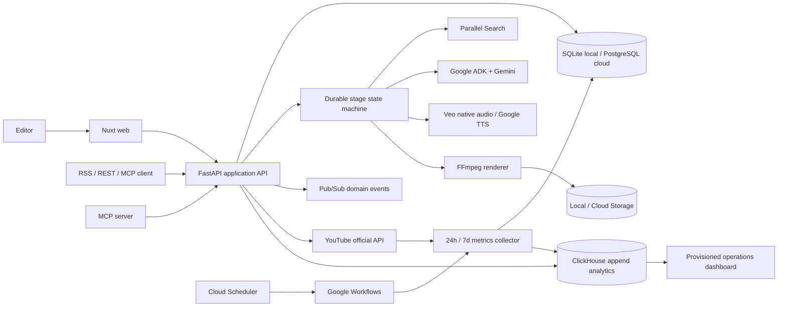
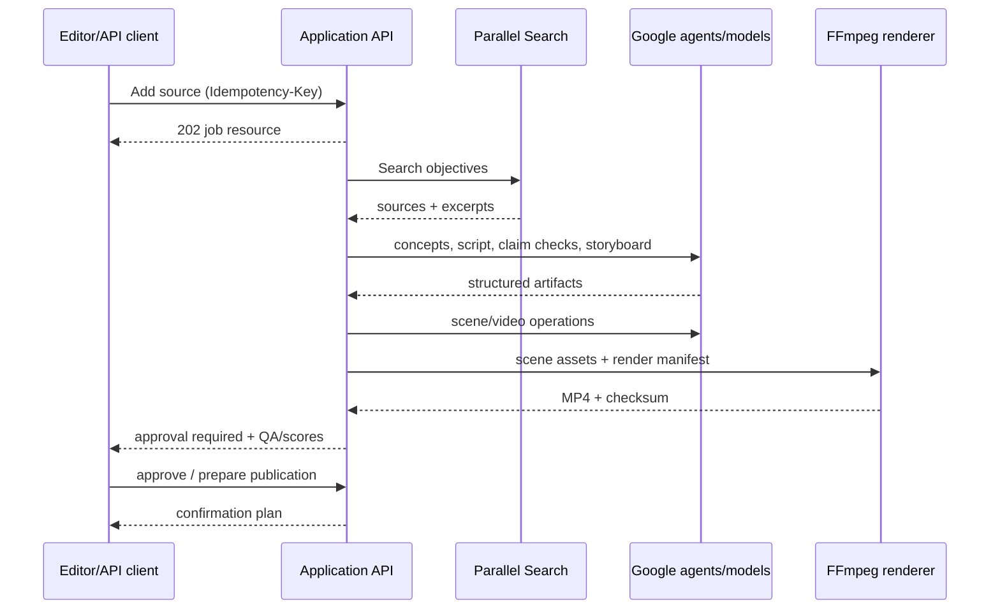

# Architecture decision: coherent P0 vertical slice

## Context

The product must prove a stateful production loop rather than a prompt-to-video demo. The implementation therefore keeps the domain and provider contracts explicit while allowing local infrastructure to be lightweight.

## Containers

## Component boundaries

- `application`: tenant-aware use cases, idempotency, audit trail, resource transitions.
- `providers`: replaceable Parallel, Gemini/ADK, Veo/TTS, publishing, metrics adapters.
- `workflow`: typed stages and retry-safe transitions; every stage output is persisted.
- `rendering`: deterministic text/logo/subtitle/CTA overlays and final H.264/AAC output.
- `web`: no provider secrets; consumes the public `/v1` contract and reflects partial states.
- `mcp`: thin, scoped wrapper over the same application services; publication uses prepare/commit.

## Data flow

## Durable state

The local build stores each resource and generation stage in SQLite. The cloud deployment stores them in Cloud SQL PostgreSQL. Restarting the API reconstructs queued/in-progress workflows; a failed render resumes from persisted research/storyboard/scene/audio checkpoints instead of paying for provider calls again. Scene, audio, caption, render, and manifest objects are copied to private Cloud Storage so a new Cloud Run instance can materialize them before resuming.

PostgreSQL remains the transactional source of truth. Domain events and normalized publication facts are copied asynchronously to append-only ClickHouse tables. Failed analytics delivery is logged and never rolls back product state. Grafana reads only this event stream through a provisioned datasource; it does not become a runtime dependency.

Cloud Scheduler starts the `avs-metrics-collector` Google Workflow every 15 minutes. Workflows signs an OIDC request as the runtime service account, and the private application endpoint verifies both token audience and service-account email before collecting due checkpoints. Domain events are also published at-least-once to `avs-domain-events`; consumers use event IDs for deduplication.

## Security decisions

- Tenant scope is resolved from the authenticated principal, never trusted from request bodies.
- URL fetching performs scheme, DNS, redirect, address-range, MIME, size, and timeout checks.
- Retrieved pages are data; they cannot select tools or alter system instructions.
- API keys are prefix + salted hash. OAuth tokens are referenced from a secret store.
- Hard policy, rights, technical, consent, and budget gates cannot be overridden by ordinary scores.
- Webhooks include event ID, timestamp, HMAC-SHA256 signature, replay window, and delivery log.

## Degradation

If Parallel is required and unavailable, research-backed generation pauses. If live Veo is unavailable, the job fails visibly and can resume from its last durable checkpoint; production never labels a deterministic fixture or motion-graphics substitute as a successful provider render. If analytics/observability is unavailable, the core workflow continues with buffered events.
